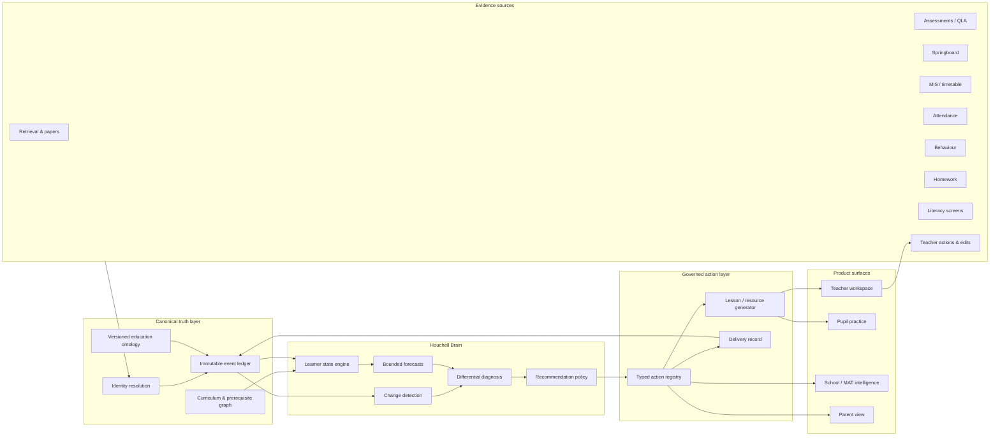

# School Intelligence Mastermind

> Implementation update (30 July 2026): stages 7–14 are now implemented locally.
> See [STAGES_7_12_IMPLEMENTATION.md](./STAGES_7_12_IMPLEMENTATION.md) for the
> evidence spine, identity workflow, generation lineage, evaluation layer,
> cross-domain imports and the database activation gate. See
> [STAGE_13_CURRICULUM_KNOWLEDGE_GRAPH.md](./STAGE_13_CURRICULUM_KNOWLEDGE_GRAPH.md)
> for the governed prerequisite, misconception and vocabulary graph that now
> feeds reviewed curriculum context into lesson generation.
> See
> [STAGE_14_GOVERNED_SHADOW_FORECASTING.md](./STAGE_14_GOVERNED_SHADOW_FORECASTING.md)
> for the model registry, immutable feature snapshots, expiring next-attempt
> forecasts and temporal calibration gate.

> A unified design for the “Palantir of education”: one governed brain that
> observes learning, estimates what pupils know, detects meaningful change,
> forecasts bounded outcomes, recommends an action, generates the teaching
> response, and learns from what happened next.
>
> Written 2026-07-28 against the current Houchell monorepo and the uncommitted
> `/intel` prototype. This is the product and architecture master plan. It
> consolidates, rather than replaces, the existing
> [Learning Intelligence OS plan](LEARNING_INTELLIGENCE_OS_PLAN.md),
> [education-intelligence synthesis](education-intelligence/00-SYNTHESIS.md),
> [system analysis](SYSTEM_ANALYSIS.md), and
> [mastery graph](MASTERY_GRAPH.md).
>
> The companion [Unified Education OS product map](UNIFIED_EDUCATION_OS.md)
> describes how the existing curriculum, teaching, assessment, intelligence,
> intervention, pupil and parent products become one role-aware experience.

---

## 1. The decision

Build **one education intelligence brain with several products attached to it**.
Do not build a giant LLM, a second data silo, or a dashboard that merely displays
more charts.

The brain is a set of six versioned capabilities:

```text
OBSERVE → ESTIMATE → FORECAST → RECOMMEND → GENERATE → EVALUATE
```

1. **Observe** — receive trustworthy events from retrieval, assessments, MIS,
   attendance, behaviour, homework, literacy screening, lesson delivery and
   teacher feedback.
2. **Estimate** — maintain a current, uncertain state for every pupil × objective,
   class × misconception and cohort × trend.
3. **Forecast** — answer a specific question over a specific horizon, with a
   probability or interval and an expiry date. Never emit a universal “risk score”.
4. **Recommend** — rank possible teaching or operational responses, show the
   evidence, and let a human accept, edit, reject or add professional judgement.
5. **Generate** — turn an accepted response into a lesson deck, re-teach sequence,
   hinge question, retrieval set, worksheet, parent explanation or leadership brief.
6. **Evaluate** — link the action and generated artifact to subsequent attempts,
   learning gains and teacher edits, then improve the state model, recommendation
   policy and content selection.

The compounding asset is not the model. It is the growing history of:

```text
context → finding → human decision → teaching artifact → delivery → pupil response → outcome
```

That is the part no generic AI tool, MIS dashboard or PowerPoint generator owns.

### The external promise

Do not sell “an ontology” or “AI predictions”. Sell:

> **Know what changed, understand the plausible explanations, and have tomorrow’s
> teaching response built from the evidence.**

“Palantir for education” is a useful internal architecture metaphor. It is not the
customer-facing positioning.

---

## 2. What already exists

The current system is much closer to this vision than a greenfield build.

| Capability | Current asset | Verdict |
|---|---|---|
| Trust → school → class tenancy | Supabase schema, RLS and role-gated RPC pattern | **Keep; crown-jewel foundation** |
| Curriculum graph | `subjects`, `strands`, `objectives`, topic crosswalk | **Keep; reconcile schema drift** |
| Pupil learning evidence | retrieval responses, papers, QLA, Springboard | **Keep; identity must be unified** |
| Pupil × objective state | `pupil_objective_mastery` and Springboard mastery | **Keep; evolve into a temporal state model** |
| Misconceptions | wrong-answer inputs + cached LLM clustering | **Partial; needs a stable taxonomy and outcomes** |
| School/trust analytics | snapshot-first dashboards and impact views | **Keep; move from route fan-out to read models** |
| Lesson and PowerPoint generation | `/api/lesson-generator`, `/api/slides-assistant`, feedforward, PPTX export | **Keep; make context-driven and outcome-linked** |
| MIS connector | Wonde student, class and contact staging | **Partial; no production identity resolution or broad domain ingest** |
| Audit and AI budgets | `audit_log`, role RPC audit, token/spend controls | **Keep; extend to every brain action and model run** |
| Intelligence ontology | `src/lib/intel/ontology.ts` | **Excellent design prototype; currently code-local** |
| Purpose-based access | `src/lib/intel/scope.ts` | **Excellent design prototype; must be enforced server-side** |
| Differential diagnosis | `src/lib/intel/analytics.ts` | **Excellent demonstrator; currently synthetic/descriptive** |
| Action layer | `src/lib/intel/actions.ts` | **Correct pattern; currently in-memory only** |
| Intelligence data | `src/lib/intel/synth.ts` | **Synthetic demo; not a production source** |
| Attendance, behaviour, literacy, homework | no canonical production tables | **Missing** |
| Canonical pupil identity | five incompatible pupil representations | **Foundational gap** |
| Prediction and model registry | none | **Missing** |
| Intervention/action outcomes | no durable intervention loop | **Missing** |
| Schema source of truth | migration ledger without the live SQL bodies | **Blocking platform risk** |

### The honest current state

You have:

- a real education product ecosystem;
- a real mastery graph;
- a strong tenancy/security pattern;
- a sophisticated **prototype of the future intelligence experience**; and
- multiple working generation engines.

You do not yet have:

- the canonical identity layer that lets all of those systems refer to the same child;
- the event and outcome ledger that allows the system to learn;
- production attendance, behaviour, literacy or homework data;
- persistent findings/actions;
- a validated forecasting pipeline; or
- the evidence that generated teaching responses improve learning.

The next move is therefore **connection and instrumentation**, not more surface area.

---

## 3. The architecture



### One brain, not one model

The “brain” is deliberately decomposed:

- **Postgres and the ontology** remember what exists and how it is connected.
- **The learner-state model** estimates knowledge and uncertainty.
- **Statistical models** detect change and make narrow forecasts.
- **Rules plus ranked evidence** produce a differential diagnosis.
- **A recommendation policy** decides which safe actions to offer.
- **An LLM** plans and writes teaching artifacts from a minimised context packet.
- **The evaluation layer** judges whether the whole loop helped.

An LLM should not be the database, the calculator, the permission system, the
forecasting model or the final decision-maker.

### The stable Brain API

Every product should use the same conceptual interface:

```ts
observe(event)
estimate(scope, target, asOf)
forecast(scope, target, horizon, asOf)
explain(findingId)
recommend(findingId, goal)
act(actionKey, parameters, reason)
generate(actionId, artifactType, constraints)
evaluate(actionId, outcomeWindow)
```

The implementation can change without forcing every surface to change.

---

## 4. The canonical education graph

Move the ontology out of `apps/houchell/src/lib/intel` into a shared, versioned
package when it becomes production code. It should generate:

- database enums/views and validation;
- TypeScript types;
- runtime schemas for API validation;
- action and LLM tool definitions;
- sensitivity and purpose checks;
- lineage metadata; and
- documentation.

### Core objects

```text
Organisation
  Trust → School → Department → Class → Membership

People
  Pupil → ExternalIdentity
  Staff → RoleAssignment
  Guardian → GuardianRelationship

Curriculum
  Subject → Specification → Strand → Objective → Prerequisite
  Question → Rubric → Misconception

Evidence
  Assessment → AssessmentItem → Attempt
  LearningEvent
  AttendanceSession
  BehaviourEvent
  HomeworkEvent
  LiteracyScreen

Intelligence
  MasteryState
  TrendState
  FeatureSnapshot
  Prediction
  Finding
  Hypothesis

Action and content
  Action
  Intervention
  Artifact → ArtifactVersion
  LessonDelivery
  Outcome
  HumanFeedback
```

### Links that create the moat

```text
ExternalIdentity --resolves_to--> Pupil
Attempt --by--> Pupil
Attempt --evidences--> Objective
Attempt --supports_or_refutes--> Misconception
Objective --prerequisite_of--> Objective
Pupil --member_of_during--> Class
Class --scheduled_in--> TimetableSlot
Finding --supported_by--> Evidence
Action --responds_to--> Finding
ArtifactVersion --generated_for--> Action
LessonDelivery --used--> ArtifactVersion
Intervention --targets--> Pupil / MasteryState
Outcome --evaluates--> Action / ArtifactVersion / ModelVersion
```

Every temporal link needs `valid_from` and `valid_to`. A pupil’s class, a teacher’s
timetable and a SEND status are not timeless properties.

### Canonical identity comes first

Create one internal `pupil_id` and resolve every source to it:

```text
retrieval user
assessment_marks.student_ref
mis_students.external_id / UPN
springboard pupil
guardian_student.student_id
```

Keep source identifiers in `external_identities`; never overwrite source truth. A
match carries:

- source;
- external key;
- canonical `pupil_id`;
- match method;
- confidence;
- evidence;
- resolver/version;
- reviewed status; and
- validity dates.

Use deterministic matches first (source ID, UPN where permitted, school + admission
number). Probabilistic matching belongs in a quarantine/review flow, never as an
invisible merge. Incorrectly joining two children is worse than leaving a row unmatched.

---

## 5. The event ledger: how the brain remembers

Current tables store product state. The brain also needs a common, immutable event
envelope so that state and predictions can be rebuilt “as of” any date.

```json
{
  "event_id": "uuid",
  "tenant_id": "school-or-trust-boundary",
  "event_type": "question_answered",
  "occurred_at": "2026-09-12T10:41:00Z",
  "recorded_at": "2026-09-12T10:41:02Z",
  "actor_ref": {"type": "Pupil", "id": "uuid"},
  "object_refs": [
    {"type": "Objective", "id": "uuid"},
    {"type": "Question", "id": "uuid"},
    {"type": "Class", "id": "uuid"}
  ],
  "source": "retrieval",
  "source_event_id": "source-stable-id",
  "schema_version": 1,
  "sensitivity": "restricted",
  "payload": {},
  "provenance": {},
  "ingest_run_id": "uuid"
}
```

Required properties:

- append-only;
- idempotent on source + source event ID;
- tenant-stamped before any downstream work;
- source and schema versioned;
- late-arriving events supported;
- corrections represented as new events;
- complete provenance;
- sensitivity marking propagated; and
- replayable into feature and state tables.

Do not force every domain into one enormous JSON table for query. Retain typed domain
tables for integrity and performance; use the event ledger as the common history and
trigger surface.

---

## 6. The intelligence engines

### 6.1 Learner-state engine

Replace a single `% correct` with a state carrying uncertainty:

```text
pupil_id
objective_id
as_of
estimated_mastery
uncertainty
evidence_count
last_evidence_at
forgetting_adjustment
misconception_probabilities
source_mix
model_version
```

Evolution:

1. **Now:** keep the existing blended retrieval + paper + Springboard mastery as the
   transparent baseline.
2. **Next:** add recency, item difficulty, evidence reliability and confidence bounds.
3. **Later:** use a dynamic IRT/Bayesian knowledge-tracing model so that question
   difficulty, guessing, slips and forgetting are represented explicitly.

The baseline must always remain available. A complex model only ships if it beats the
simple one on held-out, future data.

### 6.2 Change detection

This should be the default form of pupil intelligence:

- “performance in this subject changed relative to this pupil’s own prior pattern”;
- “behaviour events in this slot are above its seasonally expected range”;
- “homework completion changed for this class over three weeks”; or
- “this misconception persisted after the re-teach”.

Use rolling baselines, control charts, EWMA/CUSUM or Bayesian change-point methods.
Report:

- what changed;
- when it changed;
- size of change;
- expected range;
- data completeness;
- whether it persisted; and
- the evidence that would rule it out.

### 6.3 Performance forecasts

Predictions are allowed only as named contracts:

| Target | Grain | Horizon | Output | First model |
|---|---|---|---|---|
| Next question correct | pupil × objective | next attempt | calibrated probability | regularised logistic baseline |
| Objective secure | pupil × objective | 2–6 weeks | probability + interval | mastery state transition |
| Next common assessment | pupil × subject | next window | score/grade distribution | prior-score + mastery ordinal/quantile model |
| Class objective mastery | class × objective | 2–6 weeks | expected range | hierarchical trend model |
| Cohort behaviour volume | class/slot/year | 1–4 weeks | expected count range | seasonal Poisson/negative-binomial model |

Every stored prediction must include:

```text
prediction_id
target and intended_use
subject and scope
as_of and horizon
value / probabilities / interval
baseline prediction
confidence and missingness
evidence snapshot
model_version and feature_version
expires_at
actual outcome when known
human response
```

There is no generic pupil “risk score”. There is no prediction without a horizon.
There is no prediction without an intended use.

### 6.4 Behaviour intelligence

Behaviour data reflects recording and sanctioning practices as well as pupil behaviour.
Build this domain in this order:

1. data completeness and coding consistency;
2. cohort, timetable-slot and location trends;
3. within-pupil change detection visible to the people who already support that pupil;
4. response tracking; and only then
5. bounded forecasts of event volume.

Do not build an individual “likely to misbehave” ranking. The useful product is:

> “This class/slot/pupil pattern changed; these are the observations; these are the
> plausible operational, curriculum and opportunity-to-learn explanations; what do you
> know that the data does not?”

### 6.5 Differential diagnosis

Keep the current `/intel` pattern. A finding should contain ranked hypotheses rather
than a declared root cause.

Candidate explanations can include:

- regression to the mean / measurement noise;
- attendance and missed curriculum;
- prerequisite not secure;
- assessment text demand vs reading access;
- change of set, timetable, room or group composition;
- curriculum sequencing;
- task difficulty or rubric change;
- homework opportunity/completion;
- persistent misconception;
- data quality or identity mismatch; and
- genuinely unexplained change requiring human knowledge.

Each hypothesis needs:

- supporting and conflicting evidence;
- discriminating signal;
- what would rule it out;
- provenance;
- uncertainty; and
- permitted actions.

### 6.6 Recommendation policy

The first policy is transparent rules, not reinforcement learning.

Example:

```text
IF class misconception is common
AND prerequisite mastery is secure
AND recheck has not already occurred
THEN offer:
  1. generate misconception-confronting reteach
  2. generate hinge question
  3. assign short recheck
```

Rank actions using:

- fit to the finding;
- evidence strength;
- teacher time;
- likely pupil benefit;
- reversibility;
- past effectiveness in similar local contexts; and
- whether the action has already been tried.

Only after a substantial history of actions and outcomes should the ranking policy learn
statistically. It still proposes; the human still acts.

---

## 7. The lesson-generation loop

The current lesson generator is already a strong renderer and authoring engine. The
missing step is a **pedagogical plan compiled from evidence**.

### Current flow

```text
unit + optional lesson + teacher focus
    → hard-coded lesson-type prompt
    → slides assistant pass 1
    → slides assistant pass 2
    → saved deck
```

### Target flow

```mermaid
flowchart LR
    F["Finding / teacher goal"] --> CS["Minimised context snapshot"]
    CS --> P["Deterministic pedagogical planner"]
    P --> S["Structured lesson specification"]
    S --> V["Safety + curriculum validation"]
    V --> G["LLM content generation"]
    G --> R["Slide renderer / editor"]
    R --> H["Teacher accepts, edits or rejects"]
    H --> D["Lesson delivery"]
    D --> O["Retrieval / assessment outcome"]
    O --> E["Artifact and policy evaluation"]
    E --> P
```



### Context snapshot

The generator receives a snapshot ID, not unrestricted database access and not a dump
of named pupil records. The snapshot contains only what the action requires:

- subject, key stage, specification and lesson objective;
- prerequisite graph;
- class mastery distribution;
- top misconceptions with counts and anonymised evidence;
- reading-demand target;
- recent teaching and retrieval so content is not needlessly repeated;
- available time, room, equipment and accessibility constraints;
- teacher’s accepted style defaults;
- vetted diagrams, examples and resources;
- requested lesson type; and
- finding/action lineage.

Names, UPNs, raw behaviour notes, SEND/EHCP text, safeguarding data and unnecessary
demographics never enter the LLM request.

### Structured lesson specification before slides

Generate and validate a typed specification such as:

```text
lesson_goal
objectives[]
prerequisites[]
misconceptions[]
success_criteria[]
sequence[]
  beat_type
  purpose
  duration
  teacher_move
  pupil_task
  check_for_understanding
  adaptation
questions[]
answers_and_rubrics[]
resources[]
reading_demand
total_minutes
```

The PowerPoint is a rendering of this plan. That makes the same intelligence reusable
for:

- PowerPoint;
- interactive pupil practice;
- printable booklet;
- cover work;
- parent explanation;
- re-teach group task; and
- post-lesson recheck.

### Artifact lineage

Every generated deck/resource must record:

```text
artifact_id and version
action_id and finding_id
context_snapshot_id
objective and misconception IDs
generator/model/prompt/template versions
source resource IDs
teacher edits
accepted/rejected/delivered status
class and delivery time
outcome window
```

This turns generation from a stateless convenience into a learning system.

---

## 8. How it gets better with use

“Constantly learning” must not mean silently changing itself in production. It means
four controlled feedback loops running at different speeds.

### Loop A — state learning, near real time

```text
pupil answers → evidence quality checked → mastery state updated → next best check changes
```

This updates a pupil’s state, not the global model code.

### Loop B — operational learning, daily

```text
attendance / behaviour / homework / delivery events
    → trend states refreshed
    → findings opened, updated or expired
```

Findings have a lifecycle. They should disappear when evidence no longer supports them.

### Loop C — content learning, after each delivery

Capture signals in an explicit quality hierarchy:

| Signal | Meaning | Weight |
|---|---|---|
| Teacher opened/exported | weak convenience signal | Low |
| Teacher kept/deleted a slide | content-selection signal | Medium |
| Teacher edited wording/order | precise improvement signal | Medium-high |
| Teacher explicitly rated and explained | professional judgement | High |
| Lesson marked delivered | establishes exposure | Required for outcome use |
| Hinge/recheck response | immediate learning signal | High |
| Later retrieval/assessment gain | durable learning signal | Highest |

Do not optimise for clicks, time-on-platform or deck length. Optimise for:

- teacher time saved;
- factual/curriculum quality;
- teacher acceptance with fewer edits;
- successful checks for understanding;
- durable objective gain; and
- lower recurrence of the targeted misconception.

### Loop D — model learning, scheduled and gated

```text
new labelled outcomes
    → candidate model trained
    → temporal holdout evaluation
    → calibration and subgroup audit
    → shadow deployment
    → human approval
    → version promoted or rejected
```

Never train directly against live production state and automatically replace the model.
Every model version needs:

- training cutoff;
- feature and label definitions;
- dataset/tenant permissions;
- metrics against the current baseline;
- calibration;
- subgroup error analysis in the separate fairness pipeline;
- known limitations;
- approver;
- deployment and rollback record; and
- automatic expiry/review date.

### Local and shared learning

Default to **school-local learning**:

- pupil states, action effectiveness and context stay inside the tenant;
- no cross-school raw pupil data trains a product model by default;
- shared content improvements use human-reviewed, non-identifying artifacts or an
  explicit, documented opt-in;
- cross-school comparisons are thresholded aggregates.

This is slower than indiscriminate data pooling and far more defensible.

---

## 9. Product experiences

### Teacher: “What should I do next?”

The home view should answer, in this order:

1. What changed since I last looked?
2. Which objective/misconception matters most for my next lesson?
3. Which pupils need a check or catch-up?
4. What evidence supports this?
5. What can the system build for me now?

One click on **Build the response** creates:

- a 10–20 minute re-teach;
- a diagnostic hinge;
- core and stretch practice;
- answers/rubrics;
- a short follow-up retrieval set; and
- a full PowerPoint if requested.

### Head of department: “Where does the curriculum need a response?”

- persistent misconceptions across classes;
- prerequisite/sequence failures;
- assessment and retrieval disagreement;
- literacy-access mismatches;
- action status and recheck outcomes;
- content/artifacts worth standardising;
- no teacher league table.

### Headteacher: “What structural issue can only I change?”

- timetable-slot/location patterns;
- cross-subject pupil residuals;
- attendance/opportunity-to-learn intersections;
- inclusion gaps above the reporting threshold;
- department responses and impact;
- uncertainty and missing-data warnings.

### Trust: “Where should scarce support go?”

- school-level signals only;
- comparable cohorts and data-completeness first;
- trends, actions and outcomes;
- k-anonymised aggregates;
- no named pupil drill-down.

### Pupil and parent

- clear current objectives and progress;
- recommended practice tied to actual evidence;
- explanations in accessible language;
- no hidden risk label;
- the ability to see and correct relevant data.

---

## 10. Governance: the rules that make the intelligence trustworthy

1. **Actions are the only write path.** No component, model or agent writes domain
   state directly.
2. **Every access has a purpose.** Role alone is insufficient.
3. **Every claim links to evidence and provenance.**
4. **Every prediction is bounded, time-stamped, versioned and expires.**
5. **Humans decide consequential actions.** The system proposes and records the reason.
6. **No universal risk score.**
7. **No teacher-quality inference or ranking.**
8. **No safeguarding text in the platform’s analytic/LLM layer.**
9. **Special-category attributes are excluded from inference and used only in a
   separate, aggregate fairness audit where lawful.**
10. **LLM input is minimised and tokenised.**
11. **Data quality and missingness are visible, never silently imputed in the UI.**
12. **A rejected finding is training data.** Humans must be able to say “wrong, because…”.
13. **Undo never erases history.**
14. **Generated content is versioned and attributable.**
15. **A complex model must beat a simple baseline on future data.**

---

## 11. Production topology

Keep the existing monorepo and operational Supabase anchor. Introduce boundaries rather
than a wholesale rewrite.

```text
apps/
  houchell/       teacher planning, slides and generation
  retrieval/      pupil evidence and marking
  interactive/    reusable learning content
  intelligence/   later: dedicated school/MAT intelligence surface

packages/
  db/             real, complete migration source of truth
  ontology/       object, link, action, sensitivity and purpose contracts
  brain-contracts/event and API runtime schemas
  curriculum/     objective/prerequisite/misconception contracts
  generation/     context snapshots, lesson specs and artifact lineage

workers/
  ingest/         connectors, identity resolution and quarantine
  features/       incremental feature/state computation
  models/         training, evaluation, registry and batch inference
  generation/     long-running content jobs and evaluation
```

At pilot scale:

- Supabase Postgres remains the system of record;
- use typed tables plus an immutable event ledger;
- use incremental SQL/materialised read models rather than route fan-out;
- use a Postgres-backed durable job queue;
- store source files and artifacts in object storage;
- run forecasting/training in a containerised worker, not a Vercel request;
- keep the current LLM provider behind one internal gateway;
- use embeddings only for retrieval over vetted curriculum/resources, never as the
  canonical truth layer.

Add a separate analytical store only when measured volume or query isolation requires it.
Premature warehouse work does not make the product more intelligent.

### Server-side action execution

The current in-memory `dispatch()` becomes:

```text
POST /api/actions/:key
  authenticate
  resolve purpose and scope
  validate typed input
  load evidence snapshot
  check policy / consequential confirmation
  insert immutable action request
  enqueue side effects
  append audit event
  return action ID and status
```

Workers perform side effects idempotently. They never trust client-supplied tenant,
role, pupil or evidence scope.

---

## 12. Delivery roadmap

The order matters. A beautiful prediction screen on fragmented identities is worse than
no prediction screen.

### Phase 0 — Make the foundation trustworthy (2–4 weeks)

**Outcome:** one schema, one identity plan, no known bypass.

- finish the Phase 5 security transition and remove/rotate the shared analytics key;
- populate and test real leadership roles;
- reconstruct the live anchor schema into `packages/db`;
- make migration CI and tenant-leak/RLS tests real;
- freeze the versioned ontology contract;
- define canonical `pupil` and `external_identity`;
- define event, finding, action, artifact and outcome contracts;
- build the marking golden-set eval already identified as the commercial gate.

**Gate:** no new prediction or new data domain until the live schema and authorisation
surface can be reproduced and tested from source.

### Phase 1 — Connect the real learning loop (4–6 weeks)

**Outcome:** the intelligence console works on one real science class without attendance
or behaviour.

- resolve retrieval, QLA and Springboard pupils to the canonical identity;
- write current learning evidence into the event contract;
- compute real temporal pupil × objective states;
- persist findings, hypotheses, human notes and dismissals;
- replace in-memory `/intel` actions with the server action registry;
- connect **generate re-teach** to the existing lesson generator;
- introduce context snapshots and artifact lineage;
- record teacher accept/edit/export/deliver.

**Gate:** a teacher can go from a real misconception → evidence → accepted action →
generated deck → delivered recheck, with the whole chain visible.

### Phase 2 — Learn whether the response worked (4–8 weeks)

**Outcome:** the system improves recommendations using outcomes, not usage theatre.

- generate a hinge and recheck with every re-teach;
- link later retrieval and assessment attempts to the action;
- show immediate and durable outcome windows;
- build artifact/content metrics;
- establish factuality, marking and generation evaluation suites;
- compare generated vs teacher-created response time and outcomes;
- allow the teacher to explain rejection or heavy edits.

**Gate:** demonstrate repeated closed loops and a credible teacher-time saving. Report
learning impact as association until the design supports a causal claim.

### Phase 3 — Add one cross-domain insight (6–10 weeks)

**Outcome:** prove the school-intelligence thesis without building the whole school.

- ingest attendance plus one literacy-screen format;
- productionise identity resolution and data-quality quarantine;
- implement within-pupil cross-subject change detection;
- ship reading access × assessment text demand;
- use the existing differential-diagnosis presentation;
- generate an adapted teaching response;
- evaluate whether the insight changes a real teaching decision.

**Gate:** at least one department acts differently because of a cross-domain finding and
can verify the evidence.

### Phase 4 — Validated performance forecasting (8–12 weeks)

**Outcome:** narrow, calibrated forecasts beat simple baselines.

- introduce feature snapshots and a model registry;
- define labels/horizons before training;
- create temporal train/validation/test splits;
- ship next-attempt and next-assessment baselines in shadow mode;
- evaluate calibration, Brier/MAE, coverage and subgroup error;
- expose uncertainty and expiry;
- enable forecasts only for named teaching purposes.

**Gate:** candidate models beat “last score/mastery persists” on future held-out data and
remain acceptably calibrated.

### Phase 5 — Behaviour trends (after data-quality proof)

**Outcome:** actionable pattern detection without pupil labelling.

- ingest behaviour taxonomy, timetable and location;
- measure coding coverage and staff/system variation first;
- ship class/slot/location trend detection;
- add within-pupil change alerts only within existing pastoral/teacher scope;
- track human explanations and responses;
- forecast group event volume only after stable seasonal data exists.

**Gate:** the data is sufficiently complete and consistent that the product is not merely
forecasting recording habits.

### Phase 6 — Scale the flywheel

- homework and resource-platform connectors;
- stable misconception taxonomy across subjects;
- recommendation ranking from local outcome history;
- content variants selected by class state;
- intervention effectiveness views;
- subject expansion;
- trust-level, thresholded comparisons;
- dedicated intelligence app when the `/intel` surface outgrows Houchell.

---

## 13. The first vertical slice

Do not begin with “predict GCSE results”. Begin with the shortest closed loop that proves
the brain:

```text
real wrong answers
  → persistent class misconception
  → teacher sees evidence and confirms
  → system generates a misconception-confronting PowerPoint + hinge + recheck
  → teacher edits and delivers
  → pupils answer the recheck
  → mastery and misconception state update
  → the system reports whether the response landed
```

Why this slice:

- most inputs already exist;
- the generation engine already exists;
- it delivers immediate teacher value;
- it creates clean outcome labels;
- it exercises ontology, actions, lineage and evaluation;
- it strengthens the existing commercial wedge; and
- it is the smallest real version of the full “self-improving brain”.

Only after this works should attendance/literacy and forecasting be added.

---

## 14. Success measures

### Trust and correctness

- marking agreement on the golden set;
- prediction calibration and interval coverage;
- rate of false/duplicate/stale findings;
- identity match precision and unresolved rate;
- data freshness/completeness;
- tenant-isolation and purpose-policy test coverage.

### Teacher value

- median time from finding to ready-to-teach artifact;
- teacher acceptance rate;
- amount and type of editing;
- percentage of accepted actions actually delivered;
- weekly active pilot teachers;
- self-reported minutes saved.

### Learning loop

- percentage of actions with a delivered artifact;
- percentage of deliveries with a valid recheck/outcome;
- immediate and later objective movement;
- misconception recurrence;
- effectiveness by action and context, with uncertainty;
- teacher-confirmed “changed my decision” moments.

### Business

- pilot retention at week six;
- department renewal/PO;
- deployment and onboarding time;
- AI cost per completed, delivered loop;
- gross margin per school;
- support burden.

The north-star product metric should be:

> **Evidence-backed teaching loops completed per active class, with a measured outcome.**

Not decks generated. Not predictions viewed. Not tokens consumed.

---

## 15. What not to build

- one opaque “student risk” number;
- teacher rankings or inferred teacher quality;
- an LLM that can freely query or mutate the whole database;
- an autonomous intervention allocator;
- causal “root cause” claims from observational data;
- cross-school raw-pupil training by default;
- every MIS domain before one closed loop works;
- a warehouse, graph database or vector database merely to look advanced;
- a second curriculum/mastery schema;
- a PowerPoint generator disconnected from delivery and outcomes;
- more synthetic dashboard breadth before real identity and events are connected.

---

## 16. The end state

When the system is mature, a lesson can work like this:

> Overnight, new assessment, retrieval, attendance and timetable events update the
> class state. The brain detects that a cell-transport misconception persisted after
> teaching, while prerequisite particle-model mastery is secure. The change is unlikely
> to be explained by absence and is concentrated in pupils whose reading access is below
> the paper’s demand. The teacher sees the evidence and accepts “build an accessible
> misconception re-teach”. Houchell generates a 15-minute sequence, diagram, diagnostic
> hinge, core/stretch practice and recheck inside the teacher’s house style. The teacher
> changes two examples, delivers it and marks it taught. The recheck updates each pupil’s
> mastery state. A week later, retrieval shows whether the improvement persisted. The
> artifact, the action choice and the recommendation policy are evaluated against that
> outcome. The next teacher facing the same pattern gets a better-ranked response.

That is the Palantir of education:

- everything important is connected;
- every claim is traceable;
- every action is governed;
- every teaching artifact is contextual;
- every outcome feeds back; and
- the system becomes more useful through completed learning loops, not through
  indiscriminate data collection.

---

## 17. Immediate build order

If development starts from this document, take these in order:

1. Finish the shared-key security removal and role assignment.
2. Reconstitute the real database migration source.
3. Add the canonical pupil/external-identity contract and resolution review queue.
4. Add persistent `finding`, `action`, `artifact_version`, `lesson_delivery`,
   `outcome`, `feature_snapshot`, `model_version` and `prediction` contracts.
5. Move ontology/action/scope definitions into shared server-enforced contracts.
6. Wire real retrieval/QLA/Springboard evidence into `/intel`.
7. Make `generate_reteach` call a context-snapshot-aware lesson generator.
8. Record accept/edit/deliver/recheck.
9. Complete the first misconception closed loop in one class.
10. Only then ingest attendance + literacy and begin shadow forecasting.
11. Seed the curriculum knowledge graph as proposals, have curriculum leads
    approve the first prerequisite/misconception/vocabulary neighbourhoods, and
    compare graph-grounded lesson outputs against the existing evaluation set.
12. Run the Stage 14 next-attempt baseline in shadow mode, accumulate future
    labels, and refuse release until it repeatedly beats the named baseline while
    remaining acceptably calibrated.
13. Activate the Stage 15–20 teacher operating system: source health, the
    role-scoped golden loop, human-decided recommendations, structured lesson
    contracts, policy evaluation and append-only production monitoring. See
    `STAGES_15_20_TEACHER_OPERATING_SYSTEM.md`.
14. Activate Stages 21–26: canonical MIS promotion, durable daily orchestration,
    model governance, lesson-quality evidence and one continuous operating contract.
15. Activate Stages 27–32: evidence-gated automatic signals, contextual decision
    memory, the daily teacher loop, a read-only scoped copilot and aggregate safety/
    operational proof. The system may improve recommendations from recorded use, but
    it may not accept a response, label a pupil or claim causal impact.

This sequence combines what is already built, protects the valuable foundation, and
creates the flywheel the vision actually depends on.
