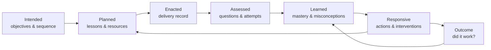

# Unified Education OS

> The product map for combining everything already built into one role-aware
> platform for trusts, schools, departments, teachers, pupils and families.
>
> Companion to [School Intelligence Mastermind](SCHOOL_INTELLIGENCE_MASTERMIND.md).
> The Mastermind defines how the intelligence brain works. This document defines
> the product wrapped around that brain.

---

## 1. The product in one sentence

> **One curriculum and intelligence system that helps every level of an education
> organisation decide what to teach, see whether it was learned, act on what
> changed, and measure whether the response worked.**

The system is not a trust dashboard plus a school dashboard plus a lesson generator.
It is:

```text
ONE GRAPH
  curriculum + people + classes + evidence + actions + resources + outcomes

ONE BRAIN
  observe + estimate + detect + forecast + recommend + evaluate

FOUR STAFF WORKSPACES
  trust + school + department + teacher

ONE LEARNING LOOP
  intend → teach → assess → understand → respond → recheck → improve
```

Pupil practice and parent communication are not separate products. They are delivery
channels attached to the same learning loop.

### The four unification primitives

Every current and future feature must declare four things:

1. **Scope** — which trust, school, department, class or pupil is in view, for what
   purpose and time window;
2. **Object** — the canonical curriculum, person, evidence, content or action object it
   reads or changes;
3. **Event** — what observation it contributes to the organisation’s memory; and
4. **Action** — which governed next step it enables.

If two screens use the same scope and object but calculate a different truth, they must
be reconciled. If a feature cannot name its object, event or action, it is probably a
disconnected tool rather than part of the OS.

---

## 2. The curriculum is the spine

The platform becomes all-encompassing by connecting every existing feature to the same
curriculum objects.

### The six views of the curriculum

1. **Intended curriculum** — what should be taught, in what sequence, against which
   specification and prerequisites.
2. **Planned curriculum** — which unit, lesson, deck, activity and assessment will be
   used, by which class and when.
3. **Enacted curriculum** — what was actually taught, for how long, using which version
   of the resource.
4. **Assessed curriculum** — which questions and tasks produced evidence against each
   objective.
5. **Learned curriculum** — current pupil/class mastery, misconceptions and uncertainty.
6. **Responsive curriculum** — what was re-taught, adapted or intervened on, and whether
   it worked.



Today, most of these pieces already exist but are spread across pages, tables and apps.
The unification move is to make `Objective`, `Class`, `Pupil`, `Lesson`, `Assessment`,
`Finding`, `Action` and `Artifact` first-class shared objects.

### What an objective should know

Open any curriculum objective and the platform should be able to show:

- where it sits in the trust/school curriculum;
- prerequisites and dependants;
- specification references and vocabulary;
- which classes are due to teach it;
- which classes have marked it taught;
- the approved/master lesson deck;
- other teacher-created decks and resources;
- interactives, booklets and retrieval questions;
- common-assessment questions and rubrics;
- misconception taxonomy;
- mastery by class/cohort;
- recent findings;
- interventions/re-teaches already attempted; and
- outcomes from those responses.

That one page would combine a large portion of the existing product.

---

## 3. One shell, changing altitude

The current navigation exposes many separate products: This week, Curriculum, Slides,
Parents, Home course, Assess, My mastery, School, Trust, Manage, Setup, Billing and
Account. The capability is impressive, but the user must understand the architecture to
find the right page.

Replace that mental model with one persistent shell.

### Global controls

Every staff user gets:

- **Scope switcher:** Trust → School → Department → Class → Pupil;
- **role/purpose indicator:** why this user can see this view;
- **time switcher:** today, week, half-term, assessment window, academic year;
- **universal search/command palette:** people, classes, objectives, lessons, findings,
  actions and resources;
- **action inbox:** new findings, approvals, reviews, failed jobs and rechecks due;
- **create button:** lesson, deck, assessment, retrieval set, intervention, report;
- **data freshness indicator:** when each source last synced; and
- **history:** recent objects and actions.

The user should never need to choose “teacher dashboard” or “school dashboard”. Their
role and selected scope determine the view.

### One scoped copilot

Combine the lesson chat, intelligence command palette and future assistants into one
copilot whose tools change with role and context.

| Role/scope | Example request |
|---|---|
| Trust | “Which support actions are overdue, and what evidence changed this half-term?” |
| School | “Where is attendance a plausible explanation for attainment change, and where is it not?” |
| Department | “Which misconceptions persisted after teaching, and build the common response.” |
| Teacher/Class | “What should I re-teach tomorrow, and make the PowerPoint and recheck.” |

The copilot:

- reads only the authorised scope and named purpose;
- cites platform evidence and data freshness;
- distinguishes observation, hypothesis and forecast;
- invokes the same typed actions as buttons in the UI;
- cannot write tables directly;
- asks for confirmation/reason on consequential actions;
- returns durable objects, not disposable chat prose; and
- records model, prompt, evidence and action lineage.

Chat is therefore another interface to the OS, not a separate source of truth.

### Role-shaped navigation

Keep the same underlying modules but change the emphasis.

| Workspace | Primary navigation |
|---|---|
| Trust | Overview · Schools · Curriculum · Outcomes · Support · Governance |
| School | Today · Curriculum · Inclusion · Departments · Interventions · Operations |
| Department | Overview · Curriculum · Classes · Assessments · Misconceptions · Resources |
| Teacher | Today · Classes · Curriculum · Create · Assess · Insights |

Admin, integrations, billing, account and compliance move into settings instead of
competing with daily work.

### Context survives every action

If a teacher starts from:

```text
Class 9S1 → Objective: diffusion → Finding: persistent particle misconception
```

then chooses **Build a re-teach**, the generator already knows:

- the class;
- the objective and prerequisites;
- the finding and evidence;
- what has already been taught;
- current mastery distribution;
- the target reading demand;
- the teacher’s style;
- available diagrams/resources; and
- that a hinge/recheck must be produced.

The user should not be asked to select the class, unit and objective again on another
page. Context is a product feature.

---

## 4. The four staff workspaces

All workspaces use the same objects, evidence and actions. They differ in grain, purpose
and cadence.

### 4.1 Trust workspace

#### The trust leader’s job

> Decide where finite support should go, align the curriculum without flattening local
> context, and know whether trust-wide actions are improving outcomes.

#### Trust home

Show:

- five most important changes since the last review;
- schools needing a conversation, with evidence and uncertainty;
- trust curriculum coverage and common gaps;
- persistent objectives/misconceptions across schools;
- school responses currently in progress;
- action outcomes and support capacity;
- data-quality/freshness warnings;
- adoption and completed learning loops;
- AI/resource costs; and
- safeguarding/compliance alerts about the platform itself, not pupil content.

#### Trust capabilities

- trust curriculum canon with school-level variants;
- approved master resources and common assessments;
- cross-school objective and cohort comparisons above disclosure thresholds;
- curriculum-sequence consistency;
- school improvement action portfolio;
- support assignment and follow-up;
- intervention/resource effectiveness across comparable contexts;
- trust-level parent/reporting standards;
- content review/publishing;
- data-sharing, retention and model-governance controls;
- school onboarding, roles and entitlements.

#### Trust rules

- no named pupil drill-down;
- no teacher ranking;
- no raw cross-school exports;
- comparison only when definitions, windows and data completeness are comparable;
- always show the trust average as context, never as an automatic league table.

#### Trust cadence

```text
Daily:      exceptional sync/security/job failures
Weekly:     material school/curriculum changes
Half-term:  support allocation and response review
Termly:     curriculum/outcome review and board/governor narrative
```

---

### 4.2 School workspace

#### The school leader’s job

> Find structural barriers, coordinate departments and inclusion, and make sure
> responses happen.

#### School home

Show:

- changes requiring a school-level response;
- department curriculum/mastery trends;
- attendance × attainment × literacy access intersections;
- inclusion gaps with suppression and data-quality rules;
- timetable/slot/location patterns;
- assessment-window summary;
- intervention/action pipeline;
- parent communication coverage;
- MIS/integration health; and
- impact narrative grounded in completed actions and outcomes.

#### School capabilities

- department and subject health;
- enacted vs intended curriculum coverage;
- assessment calendar and common windows;
- attendance, behaviour and homework trend views;
- inclusion and literacy access;
- intervention coordination;
- staff/class/timetable structures;
- MIS and external data integrations;
- parent/guardian coverage and reporting;
- school audit trail;
- role and purpose administration;
- governors/Ofsted evidence packs;
- data quality and retention.

#### Additional school roles

The same school workspace can later be purpose-shaped for:

- headteacher/SLT;
- SENDCo;
- pastoral lead;
- literacy lead;
- assessment/data lead;
- curriculum lead; and
- DSL platform-administration needs, without ingesting safeguarding case text.

These are purposes over the same objects, not separate data products.

#### School cadence

```text
Daily:      operations, attendance/behaviour changes, urgent actions
Weekly:     department exceptions and intervention status
Half-term:  curriculum, assessment, inclusion and impact review
Termly:     improvement-plan and governance evidence
```

---

### 4.3 Department workspace

#### The HoD’s job

> Know whether the curriculum is landing, standardise what should be common, and make
> the next departmental response easy.

#### Department home

Show:

- current unit/lesson position by class;
- objectives with weak or uncertain evidence;
- persistent misconceptions across classes;
- disagreement between retrieval and common assessment;
- upcoming common assessments;
- classes awaiting recheck;
- resources/decks awaiting review;
- actions assigned to the department;
- response outcomes; and
- curriculum coverage/sequence warnings.

#### Department capabilities

- edit and version the curriculum map;
- define prerequisites, vocabulary and misconception taxonomy;
- own master lesson/resource versions;
- compare classes at objective grain without ranking teachers;
- create common assessments and moderate questions;
- inspect question difficulty/discrimination and marking reliability;
- generate shared re-teaches, hinge questions and feedforward;
- group pupils for teacher-reviewed interventions;
- commission resource work;
- approve/publish teacher contributions;
- review marking flags;
- track whether department actions were delivered and effective.

#### Department operating cycle

```text
Plan
  curriculum sequence + master resources + common assessment

Teach
  class delivery + local adaptation + mark taught

See
  mastery + misconceptions + assessment disagreement

Respond
  accept finding + build/reuse response + assign/recheck

Learn
  compare outcome + update resource/curriculum/action
```

This is where the existing marking → misconception → mastery → intervention wedge grows
into a complete department operating system.

---

### 4.4 Teacher workspace

#### The teacher’s job

> Be ready for the next lesson, know which pupils need attention, and create the response
> without duplicating work.

#### Today

The first screen should show:

- today’s timetable;
- current unit/lesson for each class;
- ready-to-present deck and resources;
- what changed since the class was last taught;
- rechecks due;
- marking/review tasks;
- parent/report actions due;
- one or two recommended actions, not a dashboard of everything.

#### Class page

One class page replaces the scattered class-level gap components.

Tabs:

1. **Now** — upcoming lesson, recent changes and recommended response.
2. **Curriculum** — unit progress, taught history and objective map.
3. **Learning** — mastery, misconceptions, pupil evidence and uncertainty.
4. **Assessment** — papers, QLA, question gaps and marking review.
5. **Practice** — retrieval, Springboard, assignments and completion.
6. **Resources** — decks, booklets, interactives and revision packs.
7. **Actions** — interventions, re-teaches, communication and outcomes.
8. **Timeline** — teaching, assessment, finding, action and outcome events.

#### Teacher capabilities

- plan from the curriculum;
- use/adapt master department decks;
- create or AI-generate a full lesson;
- edit, present, print or export PowerPoint;
- generate retrieval questions/booklets from a deck;
- build cover work, practicals and revision;
- mark taught;
- set retrieval/Springboard practice;
- create/mark assessments;
- see weak objectives and misconceptions;
- generate targeted feedforward/re-teach;
- identify pupils needing a check;
- communicate progress to families;
- record professional judgement;
- dismiss an incorrect finding with a reason.

#### Teacher cadence

```text
Before lesson:  prepare from curriculum + class state
During lesson:  present + checks + adaptations
After lesson:   mark taught + capture quick outcome
Weekly:         class mastery/misconception review
Half-term:      assessment + feedforward + parent summary
```

---

## 5. The seven shared modules

These modules organise the platform. They are not seven separate apps.

### 5.1 Home and Action Inbox

Combines:

- This Week;
- role dashboards;
- `/intel` briefing/findings;
- marking reviews;
- sync/cron failures;
- rechecks due;
- content approvals;
- interventions awaiting confirmation.

Every item is:

```text
signal → evidence → owner → permitted actions → status → due date → outcome
```

### 5.2 Curriculum

Combines:

- curriculum overview;
- groups/units/lessons;
- subjects/strands/specifications/objectives;
- prerequisite graph;
- current units;
- lesson sequences;
- vocabulary;
- topic↔objective maps;
- master resources;
- coverage and taught history.

The curriculum hierarchy should be shared across trust, school, department and teacher
views, with explicit inheritance:

```text
Trust canon
  → School variant
    → Department implementation
      → Class delivery
        → Teacher adaptation
```

Variants never overwrite their parent. Differences are visible and reviewable.

### 5.3 Teaching Studio and Resource Library

Combines:

- Slides editor and presentation;
- PowerPoint/HTML/Drive import;
- PowerPoint/PDF/Google export;
- diagram library;
- interactives;
- lesson AI/chat;
- lesson generator;
- deck-to-booklet;
- deck-to-questions;
- practical assistant;
- cover sheets;
- revision packs;
- starter decks;
- shared/public/master decks;
- unit resource map.

Every artifact is linked to curriculum, owner, scope, version, evidence context, delivery
and outcome.

### 5.4 Assessment and Evidence

Combines:

- retrieval sessions;
- short-answer/MCQ marking;
- papers and paper attempts;
- common assessments/QLA;
- marking flags/review;
- class/objective gaps;
- question performance;
- mastery updates;
- marking golden-set evaluation.

Every question must map to:

```text
subject → specification → objective → skill/command word
→ misconception/rubric → difficulty → prerequisite
```

### 5.5 Intelligence

Combines:

- teacher mastery;
- school/trust snapshots;
- impact;
- weak topics/objectives;
- misconceptions;
- pupil trajectories;
- inclusion;
- literacy access;
- attendance/behaviour/homework trends;
- differential diagnosis;
- forecasts;
- evidence base;
- ontology;
- audit of human actions.

Intelligence is primarily an action feed plus navigable object pages, not a wall of
charts.

### 5.6 Response, Intervention and Communication

Combines:

- feedforward sheets/decks;
- misconception re-teaches;
- intervention lists;
- Springboard personalised follow-up;
- retrieval assignments;
- pupil rechecks;
- parent progress reports;
- parent targets;
- Home course;
- department/school briefs;
- governor/Ofsted summaries.

One action can fan out to multiple channels:

```text
Accepted response
  ├─ teacher PowerPoint
  ├─ pupil practice set
  ├─ printable worksheet
  ├─ parent explanation
  └─ leadership status/outcome
```

### 5.7 Operations and Governance

Combines:

- setup and manage;
- classes and timetable;
- timetable photo/CSV import;
- school/trust onboarding;
- role management;
- Wonde MIS sync/writeback;
- Google/Microsoft integrations;
- content pipeline;
- subscriptions/entitlements;
- AI budgets;
- audit logs;
- Trust Centre;
- privacy/export/deletion;
- cron/health monitoring.

Operations should be quiet when healthy and prominent when broken.

---

## 6. Shared object pages

The platform should feel connected because users navigate objects, not features.

### Organisation objects

| Object | Core page contents |
|---|---|
| Trust | schools, curriculum, support actions, outcomes, governance |
| School | departments, cohorts, inclusion, operations, actions, impact |
| Department | curriculum, classes, assessments, resources, misconceptions |
| Class | now, curriculum, learning, assessment, practice, actions, timeline |

### Learning objects

| Object | Core page contents |
|---|---|
| Pupil | current objectives, evidence, changes, support, timeline |
| Objective | curriculum location, resources, questions, mastery, findings, outcomes |
| Misconception | definition, evidence examples, affected groups, re-teaches, recurrence |
| Assessment | blueprint, questions, marking, QLA, reliability, response |
| Question | objective/rubric, attempts, difficulty, discrimination, marking quality |

### Action/content objects

| Object | Core page contents |
|---|---|
| Finding | claim, evidence, hypotheses, human notes, actions, expiry |
| Action | reason, owner, scope, tasks, artifacts, delivery, outcome |
| Lesson | curriculum intent, plan, deck/resources, delivery, evidence |
| Artifact | version, lineage, edits, use, outcomes |
| Intervention | pupils/groups, goal, response, consent/owner, recheck, outcome |

Every object page uses the same five rails:

```text
Overview | Evidence | Related | Actions | History
```

---

## 7. Where everything already built goes

### Staff application

| Existing feature | Unified destination | Keep/change |
|---|---|---|
| `/` This Week | Teacher → Today | Keep logic; add findings/actions |
| `ChatSidebar` / lesson chat | Scoped OS copilot | Keep streaming UX; replace lesson-only tools with role/action tools |
| `/curriculum` | Curriculum map | Keep; add objective intelligence |
| `/unit/*` and lesson pages | Unit/Lesson object pages | Keep; compose existing panels |
| `/slides` | Teaching Studio + Library | Keep editor; reduce separate filing workflow |
| Slide presentation/notes/print | Artifact delivery modes | Keep |
| Lesson generator | `build_lesson` / `build_reteach` actions | Keep engine; add context snapshot + lineage |
| Slides assistant/chat | Artifact copilot | Keep; scope tools and log versions |
| Deck-to-questions | Artifact action | Keep; map generated questions to objectives |
| Deck-to-booklet | Artifact action | Keep |
| Cover sheet | Artifact recipe | Keep |
| Practical assistant | Artifact recipe | Keep |
| Revision pack | Artifact recipe | Keep |
| Feedforward sheets/decks | Response module | Merge recipes and outcome tracking |
| Diagram library | Resource library | Keep |
| Interactive catalog | Resource library | Keep |
| `/assessments` | Assessment object/workspace | Keep; replace name-string pupil roster |
| `/teacher` | Teacher/Class Intelligence | Merge into class pages and teacher briefing |
| `/school` | School workspace | Merge with head-level `/intel` |
| `/school/intervention` | Response/Interventions | Keep export; persist actions/outcomes |
| `/school/impact` | School Outcomes | Keep; ground narratives in action lineage |
| `/trust` | Trust workspace | Merge with trust-level `/intel` |
| `/parents` | Communication | Keep; unify guardian identity |
| `/home-course` | Pupil/family delivery channel | Keep |
| `/manage` + `/setup` | Operations → Classes & timetable | Consolidate |
| `/school/integrations` | Operations → Data sources | Consolidate |
| `/content` | Curriculum/Resource publishing | Keep review workflow |
| `/intel` | Shared Intelligence layer | Keep interaction model; replace synthetic adapters |
| `/billing`, `/account`, Trust Centre | Settings/Governance | Keep; remove from daily nav |

### Retrieval application

| Existing feature | Unified destination | Keep/change |
|---|---|---|
| Student practice | Pupil Practice | Keep as focused pupil surface |
| Teacher class/completion views | Class → Practice | Deep-link/embed into staff OS |
| Questions/topics | Assessment/Evidence + Curriculum | Canonical objective mapping |
| Papers/paper results | Assessment objects | Share identity and event contracts |
| MarkReview | Action Inbox → Marking review | Keep |
| Class gaps | Class → Learning | Merge with mastery/read model |
| Misconceptions | Intelligence → Misconception | Stable taxonomy + action/outcome |
| Lesson starters | Teaching Studio recipe | Keep |
| Feedforward | Response artifact | Merge lineage |
| HoD/Admin/Schools panels | Department/Operations | Retire duplicate staff surfaces after parity |
| Parent token report | Communication | Migrate to canonical guardian relationship |

### Springboard, interactive and platform services

| Existing feature | Unified destination |
|---|---|
| Springboard progress/mastery | Pupil Practice + mastery evidence |
| Revision pages/booklets | Resource library + assigned response |
| Static interactives | Resource library + lesson delivery evidence |
| Parent reports/portal | Communication + Pupil object |
| School/trust snapshots | Intelligence read models |
| Cohort outcomes | Outcome/evaluation layer |
| MIS sync/writeback | Operations data source |
| AI budget/usage | Governance and cost |
| Audit log | Shared action history |
| Buyer pack/Trust Centre | Governance and procurement |

### What should be retired through consolidation

- duplicate teacher/HoD dashboards in the retrieval app;
- separate Setup and Manage flows;
- separate weak-topic, unit-gap, paper-gap and mastery mental models;
- separate generation endpoints presented as unrelated tools;
- manually reselecting class/unit/objective when moving between features;
- parallel pupil identities;
- parallel subject fields;
- in-memory intelligence actions;
- app-layer analytics fan-out;
- duplicated navigation definitions in `Sidebar` and `TopNav`.

Retire surfaces only after the unified replacement reaches functional parity.

---

## 8. End-to-end workflows

### 8.1 Teacher: tomorrow’s lesson

```text
Today
  → open next class
  → see current objective + what changed
  → inspect evidence
  → accept “address persistent misconception”
  → generate re-teach deck + hinge + retrieval recheck
  → edit two slides
  → present and mark taught
  → pupils complete recheck
  → class mastery updates
  → action closes or remains open
```

Existing assets used:

- timetable;
- current unit;
- objective mastery;
- misconception inputs;
- lesson generator;
- slide editor;
- diagrams;
- deck-to-questions/retrieval;
- mark taught;
- impact calculation.

### 8.2 HoD: common curriculum response

```text
Department briefing
  → same misconception appears in three classes
  → confirm evidence and prerequisite state
  → commission common resource
  → best existing deck is adapted and approved as master
  → teachers receive action in their class context
  → common hinge/recheck is delivered
  → department sees recurrence and outcome by class
  → curriculum/resource is updated
```

Existing assets used:

- class weak topics;
- mastery blend;
- content/master deck flags;
- shared decks;
- feedforward;
- assessments;
- department action layer.

### 8.3 School: literacy access

```text
School briefing
  → subject-specific trajectory changes detected
  → reading demand × literacy screen supports access hypothesis
  → SLT sends finding to HoD, not a judgement about a teacher
  → department commissions readability pass + adapted re-teach
  → teachers deliver and recheck
  → school sees whether access gap narrowed
```

New data required:

- canonical pupil identity;
- literacy screen;
- cross-subject assessment;
- whole-school classes/departments.

Existing assets reused:

- `/intel` diagnosis;
- curriculum/resources;
- action layer;
- lesson generation;
- outcome/impact views.

### 8.4 Trust: allocate support

```text
Trust briefing
  → one curriculum objective persists across several schools
  → data definitions/completeness checked
  → trust leader opens aggregate evidence
  → creates support action
  → schools/HoDs receive locally scoped response
  → shared assessment/resource is offered, not forced
  → trust reviews implementation and outcome
  → effective resource becomes a trust master version
```

No named pupil or teacher data needs to cross the school boundary.

---

## 9. The unified “brain” contract

All modules publish and consume the same event/action contracts.

### Events

```text
curriculum_version_published
class_unit_started
lesson_planned
artifact_created
lesson_delivered
objective_marked_taught
question_answered
assessment_mark_recorded
mark_reviewed
mastery_updated
finding_opened
finding_confirmed
finding_dismissed
action_requested
action_completed
practice_assigned
intervention_started
recheck_completed
outcome_evaluated
parent_report_sent
```

### Actions

Organise the growing action registry by domain:

```text
CURRICULUM
  propose_sequence_change
  publish_curriculum_version
  commission_resource
  approve_master_resource

TEACHING
  build_lesson
  build_reteach
  adapt_readability
  build_cover
  build_practical

ASSESSMENT
  build_hinge
  build_recheck
  build_common_assessment
  review_mark

PUPIL RESPONSE
  assign_retrieval
  assign_springboard
  propose_intervention_group
  start_intervention
  close_intervention

COMMUNICATION
  brief_department
  brief_school
  generate_parent_report

OPERATIONS
  review_timetable
  resolve_identity
  acknowledge_data_quality_issue
```

Every action records:

- purpose;
- actor and scope;
- trigger/finding;
- evidence snapshot;
- parameters;
- owner;
- status/due date;
- generated artifacts;
- delivery;
- human edits/notes;
- outcome; and
- audit/undo history.

---

## 10. Product architecture

Do not physically merge all three apps at once.

### Near-term boundaries

```text
apps/houchell
  Staff Education OS
  curriculum + teaching + assessment + intelligence + operations

apps/retrieval
  Focused pupil practice runtime
  staff pages progressively deep-link back to Houchell

apps/interactive
  Focused content runtime
  resources registered and launched from Houchell

Supabase anchor
  shared identity + ontology + event/action/outcome contracts
```

### Integration principles

1. **Contract before component.** Shared identity/object/action contracts come before
   attempting a giant frontend merge.
2. **One auth and tenancy interpretation.** Role and scope checks are server-side and
   consistent across apps.
3. **Deep links carry context IDs.** Staff move between surfaces without repeating setup.
4. **Events connect runtimes.** Pupil/interactive apps publish evidence; the staff OS
   consumes read models.
5. **No direct cross-app table assumptions.** Shared contract views/functions are
   versioned in `packages/db`.
6. **RLS on every exposed table.** Views used for staff read models are
   `security_invoker`; privileged functions have explicit execution grants and internal
   authorisation checks.
7. **One generation gateway.** Existing recipes share budget, provenance, context,
   model/prompt versions and evaluation.

The current Supabase owner-RLS + role-gated RPC pattern is worth preserving. The
consolidation must strengthen, not bypass, it.

---

## 11. Delivery plan: combine before expanding

### Release A — One shell and one language

**Goal:** the system feels like one product before deep backend work.

- replace duplicate nav definitions with one role-aware navigation model;
- add scope/time controls;
- create unified Home/Action Inbox shell;
- define canonical labels: Curriculum, Classes, Assess, Intelligence, Library,
  Operations;
- add object-link conventions;
- deep-link existing pages with context;
- move account/billing/setup into Settings;
- show data freshness globally.

No existing feature is deleted.

### Release B — One class learning loop

**Goal:** combine the deepest existing vertical slice.

- canonical pupil identity for retrieval + assessment + Springboard;
- one Class page composing curriculum, mastery, assessment, practice, resources and
  actions;
- one Objective page;
- persistent findings/actions;
- context-aware `build_reteach`;
- delivery and recheck events;
- action outcome view.

This is the first genuinely unified release.

### Release C — Department OS

**Goal:** make the product indispensable to a HoD.

- Department object and role scope;
- curriculum versioning and prerequisites;
- misconception taxonomy;
- common assessment workflow;
- resource/master-deck review;
- department action board;
- class comparison at objective grain;
- response outcome review.

### Release D — School OS

**Goal:** connect learning to structural school decisions.

- school department/cohort read models;
- canonical whole-school timetable;
- attendance + literacy ingest first;
- inclusion and cross-subject residual views;
- school intervention portfolio;
- data-quality and integration centre;
- school impact/evidence pack.

### Release E — Trust OS

**Goal:** support allocation and curriculum/outcome learning across schools.

- trust curriculum inheritance/variants;
- thresholded cross-school read models;
- support action portfolio;
- shared resource/common-assessment publishing;
- comparable action/outcome analysis;
- trust governance, costs and model oversight.

### Release F — Behaviour/homework and bounded forecasts

Only after identity, timelines and data-quality proof:

- behaviour/timetable/location trends;
- homework/effort events;
- within-pupil change detection in authorised scope;
- cohort event-volume forecasts;
- academic forecasts in shadow mode, then calibrated release.

---

## 12. The first twelve combined-product epics

1. **Unified navigation contract** — one source used by desktop/mobile shells.
2. **Scope bar** — role, organisation, class and time context.
3. **Canonical pupil identity** — external IDs, review queue and temporal memberships.
4. **Department object** — curriculum/class/staff scope missing from the live model.
5. **Class 360 page** — compose existing data before creating new analytics.
6. **Objective 360 page** — the core curriculum-intelligence object.
7. **Persistent action service** — replace `/intel` in-memory dispatch/history.
8. **Generation context snapshots** — connect findings to existing lesson/feedforward
   engines safely.
9. **Artifact and delivery lineage** — know which deck/resource was actually used.
10. **Recheck/outcome loop** — measure whether the response landed.
11. **Unified read models** — replace route fan-out and duplicated gap calculations.
12. **Action Inbox** — give every role one place to work from.

Do these before adding a large new data domain or a sophisticated predictive model.

---

## 13. Definition of “combined”

The platform is genuinely combined when:

- the same pupil/class/objective IDs are used everywhere;
- a user can move from curriculum to evidence to response without re-entering context;
- every role sees the same object graph at an appropriate grain;
- every generated artifact knows why it was made;
- every delivered artifact can be connected to later pupil evidence;
- findings and actions persist across dashboards and apps;
- one action can create teacher, pupil, parent and leadership outputs;
- school/trust views aggregate completed local loops rather than recomputing unrelated
  metrics;
- there is one role/purpose/access interpretation;
- duplicate staff dashboards can be retired without losing capability.

The platform is not combined merely because all links appear in one sidebar.

---

## 14. The larger destination

At maturity, the system becomes the organisation’s memory:

- the curriculum it intended;
- the lessons and resources it used;
- the adaptations teachers made;
- the evidence pupils produced;
- the changes the brain detected;
- the decisions professionals made;
- the interventions and communication delivered;
- the outcomes that followed; and
- the models/resources/policies that improved as a result.

Trust leaders, school leaders, HoDs and teachers are then not using four different
products. They are participating in one learning organisation at different altitudes.

That is how the current collection of strong tools becomes an all-encompassing Education
OS without becoming an incoherent “everything app”.

---

## 15. Stages 21–26: the continuous teacher OS

The first production implementation of the continuously learning layer uses one bounded
flywheel:

```text
ingest → reconcile → observe → forecast in shadow → recommend → human decide
       → generate → deliver → recheck → evaluate → govern
```

| Stage | Production capability | Hard boundary |
|---|---|---|
| 21 | Explicit RLS/Data API grants and system-vs-human attribution | No anonymous intelligence access |
| 22 | Wonde staging promotion into canonical pupils, classes and memberships | Possible duplicates and unmatched classes enter review; they are not guessed |
| 23 | Daily, idempotent, step-observable intelligence cycle | A failed subsystem is recorded and cannot fail silently |
| 24 | Temporal calibration, Brier skill and drift governance | Models remain shadow-only; only a named human can record a release review |
| 25 | Lesson-contract, feedback, delivery, recheck and outcome evaluation | Contract compliance is not presented as scientific accuracy or causal impact |
| 26 | One ontology-versioned read contract for trust, school, department and teacher views | Role altitude changes visibility, not the underlying truth |

The live command centre is `/intel/operating-system`. The existing `/intel` synthetic
cohort remains the research lab; it is explicitly labelled and shares the same ontology
version rather than masquerading as live data.

The scheduler runs after the nightly MIS mirror. Every school cycle has a stable daily
key, durable step results, counts and an error summary. Retries reuse completed work.
Model and lesson evaluations are append-only evidence. Neither table is a mechanism for
automatic promotion or automatic intervention.
