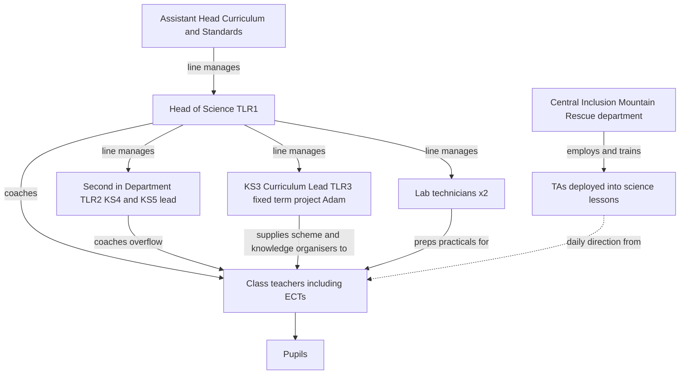
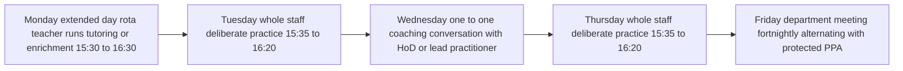
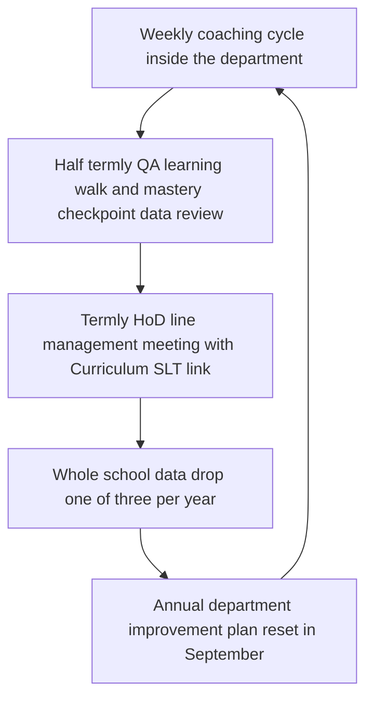

# Department Operating Model

*Operational layer beneath Section 3 (Structure, School Day and Culture). This is not a re-argument of the whole-school design — it is what a Head of Department, a class teacher, an ECT, a technician and a TA actually do, minute to minute, inside the constants Section 0 already fixes. Science is the worked example throughout (Adam's real remit: KS3 curriculum TLR3), built to generalise to any department in the 6FE, ~900-pupil secondary phase (Section 0 §1, §6). Compiled 17 July 2026; policy checked against 2025–26 sources.*

## 1. Roles: who does what

A department this size runs on five distinct roles, not a flat "HoD plus teachers" model. Blurring them is how coaching capacity quietly evaporates (research/22 point 3).

| Role | Payment | Core job | Reports to |
|---|---|---|---|
| **Head of Science (HoD)** | TLR1 (£10,174–£17,216, 2025–26 STPCD) | Owns department outcomes, budget, staffing, KS4/5 exam entries, is the default coach for most of the team | Assistant Head, Curriculum & Standards (SLT) |
| **Second-in-Department** | TLR2 (£3,527–£8,611) | Deputises for HoD, owns KS4/5 assessment and exams-officer liaison, coaches the overflow teachers the HoD cannot reach | Head of Science |
| **KS3 Curriculum Lead** (Adam's role) | TLR3 (£702–£3,478, fixed-term project) | Owns the KS3 scheme of work, knowledge organisers and resource bank as a **time-limited improvement project** — not a permanent post, per STPCD's rule that TLR3 cannot fund a continuing responsibility | Head of Science |
| **Class teachers, incl. ECTs** | Main/UPS | Deliver the taught curriculum; ECTs get a 10% timetabled reduction in year 1 and 5% in year 2 | Head of Science (professional); ECT mentor (induction) |
| **Lab technicians** | Support staff scale | Practical prep, chemical/COSHH storage, equipment maintenance, H&S — **not** pupil-facing cover | Head of Science (day-to-day); site H&S lead (technical/compliance) |
| **TAs deployed into science** | Support staff scale | Scaffold the lowest attainers toward independence in lessons; run scripted, HoD-designed interventions | Central Inclusion department (employment/CPD line); class teacher (daily direction) |

TLR values are the current 2025–26 STPCD ranges ([DfE STPCD 2025](https://assets.publishing.service.gov.uk/media/687a6260312ee8a5f0806bb5/School_teachers__pay_and_conditions_document_2025_and_guidance_on_school_teachers__pay_and_conditions.pdf); [NASUWT summary](https://www.nasuwt.org.uk/advice/pay-pensions/teaching-and-learning-responsibility-payments/teaching-learning-responsibility-payments-england.html)). From September 2025, TLR1/TLR2 move to proportional payment based on actual responsibility rather than contracted hours — worth flagging now because it changes what a part-time 2ic or job-share HoD is paid, and becomes mandatory from September 2026. A teacher can hold a TLR3 concurrently with a TLR1 or TLR2, which is exactly the Adam model: a substantive class-teacher post plus a bounded TLR3 project sitting inside, not replacing, the permanent HoD/2ic structure.

**The TA line is deliberately not owned by the department.** Following Section 3's "Mountain Rescue" design, TAs are employed and professionally developed centrally by the inclusion department, not recruited or appraised by individual HoDs — because the EEF's March 2025 guidance shows TAs velcroed permanently to one subject or one pupil is where "unstructured 1:1 support" turns negative ([EEF Deploying Teaching Assistants](https://educationendowmentfoundation.org.uk/education-evidence/guidance-reports/teaching-assistants)). The HoD's job is narrower and sharper: design the scripted intervention (e.g., pre-teaching key vocabulary before a practical), train the TA in it, and never let a TA become the default provision for an EHCP pupil in a science lesson.

**Staffing the department against the canon numbers.** Section 3 sets an overall secondary pupil:teacher ratio of ~1:16 across 900 pupils (Section 0 §6). Modelling science's own curriculum-time share against a 6FE structure: 18 KS3 classes (Y7–9) at ~3 periods/week (54 periods) plus 12 KS4 classes (Y10–11) at ~5 periods/week for combined science with a triple-science top stream adding roughly 10 more (≈65 periods) gives **~119 taught periods/week**. At an average ~20 teaching periods/week per FTE once TLR post-holders' reduced timetables, ECT reductions and PPA are netted out, that implies **an 8–9 FTE teaching department** — consistent with, not separately sourced from, Section 3's whole-school ratio. Technician staffing follows CLEAPSS's guidance ([GL100](https://science.cleapss.org.uk/resource-info/gl100-school-science-technician-services-a-guide-for-senior-managers.aspx)), which uses a technician-hours-to-classes "service factor" rather than a fixed pupil ratio; against reported practice ratios of roughly 1:800 pupils in under-resourced departments ([Preproom technician community](https://community.preproom.org/index.php?threads/new-report-shining-a-light-on-school-science-technicians.7223/)), a 900-pupil, practical-heavy department needs **2 FTE technicians**, not 1, to avoid technicians becoming the H&S bottleneck on triple-science and GCSE practical-endorsement requirements.

## 2. Department org chart

The dotted line is the load-bearing detail: TAs sit organisationally inside Inclusion, not Science, and only take daily direction from the class teacher — this is what stops informal "velcro" deployment (research/22 point 7).

## 3. Line management and accountability

**Performance appraisal is replaced by coaching, all the way up the chain, not just for classroom teachers** (Section 3, "Coaching and staff development"). The HoD coaches the teachers they can reach at the evidence-supported ratio of **~1 coach per 6–8 teachers**; in an 8–9 FTE department the 2ic or a lead practitioner picks up the overflow so no single coach exceeds that load ([Kraft, Blazar & Hogan 2018](https://scholar.harvard.edu/files/mkraft/files/kraft_blazar_hogan_2018_teacher_coaching.pdf); research/22 point 1). The HoD themself is coached upward, not left to self-direct: the Curriculum & Standards Assistant Head runs a termly line-management coaching conversation on department data, QA findings and the coaching action-step bank, supplemented by an **external subject-specific network** — the Association for Science Education's regional hub — because a generalist SLT coach cannot always give deep science-pedagogy content feedback ([ASE](https://www.ase.org.uk/)).

**QA is ungraded, developmental and frequent, mirroring the coaching logic rather than judging it.** Learning walks and work-sample scrutiny by the HoD follow Ofsted's own 2025 shift away from high-stakes "deep dives" toward "what is typical," feeding straight back into the shared action-step bank rather than producing a single graded verdict ([Ofsted Schools inspection toolkit, updated Nov 2025](https://assets.publishing.service.gov.uk/media/690b26c69456634d9795fde0/Schools_inspection_toolkit.pdf); research/22). Accountability has three fixed points a term: a **line-management meeting** (HoD with the Curriculum SLT link, reviewing the department improvement plan, coaching engagement rates and data), a **moderation sample** (6 books/class/term, per research/20, checked against whole-class-feedback quality not marking volume), and a **data drop** (one of the whole school's 2–3/year windows, per Section 3).

**ECT and struggling-teacher support is a staffing decision, not a training-content one.** The ITTECF gives content; the department has to give time. ECTs get a **10% timetable reduction in year 1 and 5% in year 2**, and mentors get **timetabled release, not goodwill time** — the exact failure mode NFER's evaluation of the early ECF roll-out flagged as null for retention ([DfE ECTE grant conditions](https://www.gov.uk/government/publications/grant-funding-for-early-career-teacher-entitlement-ecte-year-2-time-off-timetable-and-mentor-support/grant-funding-for-the-early-career-teacher-entitlement-ecte-year-2-time-off-timetable-and-mentor-support-conditions-of-grant-for-the-2025-to-2026-a); [NFER evaluation](https://www.nfer.ac.uk/publications/evaluation-of-the-early-roll-out-of-the-early-career-framework/)). The HoD assigns the department's **strongest available coach — not necessarily the most senior teacher** — to every ECT and any teacher flagged through QA as struggling, and tracks "protected mentor time actually happening" as the leading indicator, since the national entitlement alone does not move retention (research/22 point 6).

## 4. Weekly rhythm inside the directed-time budget

Section 3 publishes a directed-time budget of ~1,400–1,450 hours/year with hard boundaries: nothing directed before 07:50 or after 16:30, and the 15:30–16:30 pupil-facing block capped at **two rota'd sessions/week per teacher**. The department rhythm has to fit inside that, not add to it. A representative teacher's week — two days rota'd onto the pupil-facing extended-day block, three days free for practice and coaching — looks like this:

Three details matter more than the diagram itself:

- **The 1:1 coaching slot is named and fixed**, separate from the department meeting — the evidence is explicit that coaching depending on "whenever there's time" does not survive a hard term (research/22 point 3; [Ambition Institute](https://www.ambition.org.uk/blog/supporting-schools-to-maximise-the-impact-of-instructional-coaching/)). Each conversation runs on a single, pre-agreed action step drawn from a shared departmental library (e.g. cold-calling before reveal, checking for understanding via mini-whiteboards), not invented fresh each week, so the coach's prep time is near zero and the technique compounds term-on-term rather than resetting.
- **The department meeting is stripped of logistics.** Behaviour admin, resourcing and data entry run through school-level systems, not HoD time — Michaela's discipline applied to middle leadership (research/22 point 4). What is left, fortnightly, is: shared misconceptions surfaced by that week's coaching round, moderated work samples, and curriculum sequencing decisions for the coming half-term.
- **Twice-weekly whole-staff deliberate practice is whole-school, not department-only**, and lands on the days a teacher is *not* rota'd for the pupil-facing block — so no one's week silently grows past the published budget.

## 5. Termly and annual cadence — how the department connects upward

The HoD's upward connection to SLT runs through two channels, not one. The **line-management channel** is the termly meeting above, where the HoD is held to account for coaching coverage, QA findings and exam/data outcomes. The **peer channel** is a fortnightly or weekly Middle Leaders' Forum, chaired by the Curriculum & Standards Assistant Head, where every HoD reports the same three numbers — coaching completion rate, mastery-checkpoint RAG summary, and any ECT/struggling-teacher cases needing a staffing (not training) response — so subject silos don't drift onto different accountability rhythms. Because the whole school runs summative assessment on 2–3 fixed windows/year with a ban on additional local data drops (Section 3), the department's own half-termly mastery checkpoints (research/20) are the working data between those windows, not a parallel accountability system competing with them.

**The department improvement plan is annual, reset every September**, and is the one document that ties the whole model together: it names which teachers are due promotion-track coaching, which action steps the department is prioritising that year, the technician/TA deployment plan against the EEF rules above, and the budget lines (enrichment-hour staffing, tutoring, the retention supplement for shortage-subject and SEND-specialist roles) inherited from Section 3's whole-school workload and retention package. A HoD who cannot point to this document and say where each of coaching, QA, staffing and data sits within it does not yet have an operating department — they have a rota.

## Sources

- DfE, School Teachers' Pay and Conditions Document 2025: https://assets.publishing.service.gov.uk/media/687a6260312ee8a5f0806bb5/School_teachers__pay_and_conditions_document_2025_and_guidance_on_school_teachers__pay_and_conditions.pdf
- NASUWT, Teaching and Learning Responsibility Payments (England): https://www.nasuwt.org.uk/advice/pay-pensions/teaching-and-learning-responsibility-payments/teaching-learning-responsibility-payments-england.html
- DfE, ECTE Year 2 time-off-timetable and mentor support grant conditions (2025–26 and 2026–27): https://www.gov.uk/government/publications/grant-funding-for-early-career-teacher-entitlement-ecte-year-2-time-off-timetable-and-mentor-support/grant-funding-for-the-early-career-teacher-entitlement-ecte-year-2-time-off-timetable-and-mentor-support-conditions-of-grant-for-the-2025-to-2026-a
- NFER, Evaluation of the early roll-out of the Early Career Framework: https://www.nfer.ac.uk/publications/evaluation-of-the-early-roll-out-of-the-early-career-framework/
- CLEAPSS, GL100 — School science technician services, a guide for senior managers: https://science.cleapss.org.uk/resource-info/gl100-school-science-technician-services-a-guide-for-senior-managers.aspx
- Preproom (Science Technician Community), "Shining a light on school science technicians": https://community.preproom.org/index.php?threads/new-report-shining-a-light-on-school-science-technicians.7223/
- Association for Science Education: https://www.ase.org.uk/
- Kraft, Blazar & Hogan (2018), teacher coaching meta-analysis: https://scholar.harvard.edu/files/mkraft/files/kraft_blazar_hogan_2018_teacher_coaching.pdf
- Ambition Institute, Maximising instructional coaching: https://www.ambition.org.uk/blog/supporting-schools-to-maximise-the-impact-of-instructional-coaching/
- EEF, Deploying Teaching Assistants guidance (updated March 2025): https://educationendowmentfoundation.org.uk/education-evidence/guidance-reports/teaching-assistants
- Ofsted, Schools inspection toolkit, updated 5 Nov 2025: https://assets.publishing.service.gov.uk/media/690b26c69456634d9795fde0/Schools_inspection_toolkit.pdf
- Internal: `blueprint/0-canon.md`, `blueprint/3-structure-operations.md`, `research/22-coaching-quality-department-leadership.md`, `research/05-staffing-workforce.md`, `research/20-department-curriculum-assessment.md`
