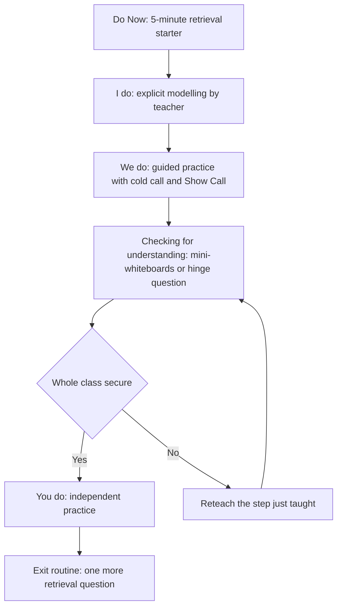
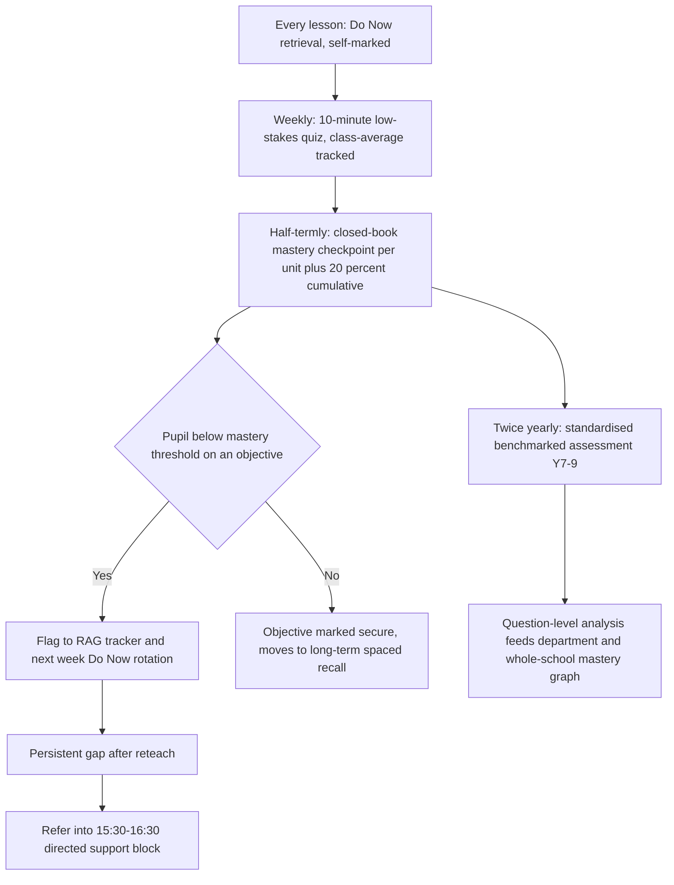

# Department Operations 1 — Curriculum, Lesson Shape, Assessment and Feedback

*Level below `blueprint/2-curriculum-pedagogy.md`. That section decided the school-wide bets: bought-in curriculum spine, Rosenshine-based teaching model, whole-class feedback over written marking, formative-core assessment. This section is what a Head of Department (HoD), a class teacher, a TA and a pupil actually do with those bets on a Monday morning. Worked example throughout: KS3 science, 6FE secondary, 900 pupils, Adam's TLR3 remit (`blueprint/0-canon.md` §1, §6) — built to generalise to any department.*

## 1. Scheme of work architecture: half-termly units on a bought spine

The whole-school layer already decided we do not author curriculum from scratch (`2-curriculum-pedagogy.md` §2). For science that spine is edited, not written: department time goes into **sequencing, adapting and resourcing**, not drafting content from a blank page.

- **Unit grain: half-termly, ~6 units per year per key stage.** Each unit has a single-page **knowledge organiser** (facts, vocabulary, diagrams — one side of A4), a bank of Do-Now retrieval questions, a mid-unit low-stakes quiz, and an end-of-unit mastery checkpoint. This is the Ark/Star KS3 science pattern of "low-stakes quiz every lesson, formal checkpoint every half-term" (`research/20-department-curriculum-assessment.md`, "What the best operators actually do").
- **Sequencing is cumulative by design, not by accident.** Every unit's Do-Now bank draws questions from the current unit, the immediately prior unit, and at least one unit from 6+ months back — interleaving and spacing built into the materials, not left to individual teacher memory, because the classroom evidence for retrieval/spacing is real but thinner than the lab evidence and needs institutionalising through materials (`2-curriculum-pedagogy.md` §3; `research/20-department-curriculum-assessment.md`, evidence caveats).
- **Centrally-resourced, not teacher-authored, at the point of delivery.** Adam's HGO lesson engine (in-app Slides system: `lessonStyle.ts`, a 117-diagram library covering every KS3 build-up concept, structured lesson types, a two-pass generator) is the department's single source of slides, model answers and diagrams. A HoD's job is curating and sequencing this bank against the half-termly units, not building decks lesson-by-lesson — the same "buy the spine, spend saved hours on adaptation" logic the whole-school section applies to English/maths (`2-curriculum-pedagogy.md` §2), applied one level down to lesson materials.
- **The knowledge organiser is the load-bearing artefact.** It drives (a) the Do-Now bank, (b) homework self-quizzing, (c) the mid-unit and end-of-unit quiz content, and (d) what a cover teacher or TA needs to know to run the lesson cold. One object, four uses — the Michaela/Kirby model (`research/20-department-curriculum-assessment.md`, sources: Joe Kirby 2015).
- **Depth-before-breadth applies to KS3 core subjects generally** (`2-curriculum-pedagogy.md` §2 protects 5–6 hrs/week English and maths in Y7–8); science's timetabled allocation sits within the KS3 non-negotiable hours the whole-school timetable fixes, but the half-termly unit cadence and cumulative Do-Now design are what actually protect depth inside that time, regardless of the exact hours a given subject gets.

## 2. The daily lesson shape

Every science lesson, every year group, runs the same four-part shape. Predictability is the point: named, drilled routines lower cognitive load, are disproportionately valuable for autistic and ADHD pupils, and are the strongest common thread in the behaviour evidence (`2-curriculum-pedagogy.md` §3; `research/03-send-evidence.md`).

- **Do Now (5 minutes, closed book, self-marked in under 2 minutes).** 4–6 questions: 2 from the current unit, 2 from the prior unit, 1–2 interleaved from 6+ months back. Answers on the visualiser; pupils self-mark; teacher circulates and notes *patterns* of error, not scores. This is the single highest-leverage, zero-marking routine a HoD can mandate department-wide (`research/20-department-curriculum-assessment.md`, design implication 1; evidence: Dunlosky et al. 2013 rate practice testing one of only two "high utility" strategies of ten reviewed, https://www.structural-learning.com/post/testing-effect-retrieval-practice; Agarwal et al. 2021 find classroom effects close to lab effects across 49 classroom studies, https://link.springer.com/article/10.1007/s10648-021-09595-9).
- **Adam's 1,960-question tagged retrieval bank (`docs/retrieval/question-bank/`) is the Do-Now spine for KS3 science.** It was built specifically from the Springboard Teacher Handbooks and tagged by unit/topic, which means a HoD does not write Do-Now questions from scratch — they select from a pre-tagged bank that already encodes the cumulative/interleaved design above.
- **I/We/You** follows Rosenshine directly: explicit modelling, worked-example fading as pupils gain competence, guided practice with **cold call** (no hands up, any pupil can be asked) and **Show Call** (a pupil's live work put under the visualiser), then independent practice only once checking for understanding shows the room is ready (`2-curriculum-pedagogy.md` §3).
- **Checking for understanding is a gate, not a formality.** Mini-whiteboards or a hinge question before independent practice — if the room isn't secure, the teacher reteaches the step immediately rather than sending pupils into 15 minutes of practising a misconception. This is the daily-cycle version of the EEF Embedding Formative Assessment logic (act on evidence of understanding in the moment), which delivered +2 months on Attainment 8 at very low cost, concentrated in the lowest-attaining third (https://educationendowmentfoundation.org.uk/projects-and-evaluation/projects/embedding-formative-assessment).

## 3. Homework: Springboard as the self-quizzing layer

Homework is self-quizzing on the knowledge organiser, not new independent learning — set-and-hope extension tasks do not show the effect; homework "integral to what happens in lesson" does (`research/20-department-curriculum-assessment.md`: EEF Toolkit rates homework ~+5 months secondary, rising toward +6 months when digitally supported, https://educationendowmentfoundation.org.uk/education-evidence/teaching-learning-toolkit/homework).

- **Springboard (`docs/learn/`) is that platform for KS3 science.** It follows the department's own unit sequence exactly (not a generic third-party syllabus), so a pupil quizzing at home on Tuesday night is quizzing on precisely what was taught Tuesday afternoon. It already has self-quizzing questions, a dashboard, voice vocabulary practice and (via PRs #51/#52) results that feed the school's mastery graph — engineered completion tracking, not "set and hope," which is the whole-school requirement (`2-curriculum-pedagogy.md` §6).
- **Ten KS3 science units still lack objective rows** in the mastery-graph mapping (a known gap — see department backlog). Closing this is a standing action for the HoD, not a blocker to using Springboard now: partial mastery-graph coverage is still better data than none.
- **Completion is monitored, not just access.** Minutes-per-week per pupil, split by PP/SEND, checked (not marked) by the class teacher — matching the whole-school discipline that access without completion has zero effect (`2-curriculum-pedagogy.md` §6, the Sparx finding).

## 4. Assessment and mastery-checkpoint calendar

Three tiers, each doing a different job, none replacing the others.

- **Weekly low-stakes quiz** (10 minutes, self- or peer-marked in lesson, recorded as a class-average dot on a tracker, never an individual written comment) on the current unit plus cumulative recall — the Michaela cadence of a weekly quiz per subject with cumulative recall of prior material, "impeding the forgetting curve" (`research/20-department-curriculum-assessment.md`; Schools Week, https://schoolsweek.co.uk/homework-habits-what-we-have-learned-at-michaela/).
- **Half-termly mastery checkpoint** (20–30 minutes, closed book, the unit just finished plus a 20% cumulative slice from prior units) feeds a simple RAG tracker per pupil per objective. A pupil below threshold on an objective is flagged into the *following week's* Do Now rotation for that objective specifically — responsive reteaching built into the existing routine, not a bolt-on. Persistent gaps after reteach are referred into the whole-school 15:30–16:30 directed support block, which is compulsory for the target cohort (`0-canon.md` §2, §6) — this is the department-level plumbing that connects a science misconception to the whole-school extended-time slot.
- **Twice-yearly standardised, benchmarked assessment (end of Y7, Y8, Y9 terms)** mirrors United Learning's model: comparable, question-level data across classes, sitting above the weekly/half-termly rhythm as an input to the mastery graph, not a replacement for it (`research/20-department-curriculum-assessment.md`; https://unitedcurriculum.org.uk/assessment). This is also the department's contribution to the whole-school ban on **teacher-predicted GCSE grades and flightpaths before Year 10** (`2-curriculum-pedagogy.md` §7) — science reports raw scores and cohort averages only at KS3.
- **No six data drops.** The whole-school assessment principle (2–3 standardised windows a year, not six) applies to science exactly as to every department (`2-curriculum-pedagogy.md` §7).

## 5. Feedback and marking policy: whole-class feedback and live marking, no written-comment marking

This is the department's explicit workload ceiling, stated so a new or anxious teacher — or a parent — has a citable answer.

- **Day-to-day exercise-book work: live/verbal marking during independent practice is the default.** The teacher circulates while pupils are working, corrects and annotates in real time or verbally, and moves on. No written comment is required or expected on routine classwork.
- **Extended writing and 6-mark answers: whole-class feedback (WCF), not individual written marking, is the department default.** The teacher reads a stack of scripts once without writing on them, populates a single WCF sheet (common misconceptions, 1–2 exemplar answers, one "next step" instruction), and pupils redraft against it in the following lesson in a different colour pen. This is the Dixons "messy marking" and Craig Barton/Jo Facer WCF model now near-universal in evidence-informed departments, cutting marking time from roughly a minute per book across 30 books to a single 10–15 minute sheet, while pupils get feedback the *next lesson* rather than a week later (`research/20-department-curriculum-assessment.md`; https://tipsforteachers.co.uk/whole-class-feedback/; https://my.chartered.college/research-hub/q-how-can-we-reduce-teacher-workload-without-affecting-the-quality-of-marking-a-whole-class-feedback/).
- **Written comment-by-comment marking is reserved for a termly QA sample** (e.g. 6 books/class/term), used for moderation and standards-checking, never as the universal expectation.
- **The evidence base for this, stated precisely.** The EEF's *Teacher Feedback to Improve Pupil Learning* guidance (Nov 2021), Recommendation 4, states schools should use "purposeful and time-efficient" written feedback and names live marking and coded/whole-class marking as evidence-consistent alternatives to exhaustive comments, because extensive marking carries a large opportunity cost against planning and subject knowledge (https://educationendowmentfoundation.org.uk/education-evidence/guidance-reports/feedback). The EEF Toolkit separately rates feedback overall at ~+6 months, very low cost (https://educationendowmentfoundation.org.uk/education-evidence/teaching-learning-toolkit/feedback). Honestly stated: there is no dedicated causal RCT comparing whole-class feedback against traditional marking on attainment — the case rests on workload-neutral-or-better outcomes plus the general feedback evidence, not a bespoke trial (`research/20-department-curriculum-assessment.md`, evidence caveats).
- **This is government and inspection policy too, not just a department preference.** The DfE's 2016 Marking Policy Review Group — convened after marking was identified as one of the three most burdensome tasks in the Workload Challenge survey — concluded that detailed written marking of every piece of work is not the most effective form of feedback (https://assets.publishing.service.gov.uk/government/uploads/system/uploads/attachment_data/file/594027/6.2798_DFE_MB_Reducing_Teacher_Workload_Pamphlet_20161207_print.pdf). Ofsted's own position, restated consistently, is that inspectors do not expect any specific frequency, type or volume of marking, and do not require a written record of verbal feedback (https://www.gov.uk/government/publications/school-inspection-handbook-eif). Both facts go in the department handbook verbatim so "Ofsted wants to see marked books" is answered before it's asked.

## 6. What this means for a HoD's week (worked example: Adam, KS3 science)

- **Curate, don't author.** Time goes into selecting Do-Now questions from the 1,960-question bank against the current unit's cumulative-recall requirement, sequencing HGO slide decks against the half-termly units, and auditing which of the 117 build-up diagrams are due in the coming fortnight — not writing new resources from scratch.
- **Own the RAG tracker.** After each half-termly checkpoint, the HoD (not each class teacher independently) reviews department-wide objective-level RAG data, decides which objectives need a department-wide reteach slot in the following week's Do Now rotation, and which individual pupils need referral into the 15:30–16:30 directed block.
- **Close the mastery-graph gap.** The ten KS3 science units still missing objective rows in Springboard's mastery-graph mapping are a standing HoD action, tracked against the department's own backlog, not a reason to delay using Springboard for the units that are already mapped.
- **Protect the workload ceiling.** No science teacher in the department is expected to write individual comments on routine classwork; WCF sheets and live marking are the stated default, and the HoD's QA role is sampling books termly for standards, not policing marking volume.

## Sources

- [EEF: Embedding Formative Assessment](https://educationendowmentfoundation.org.uk/projects-and-evaluation/projects/embedding-formative-assessment)
- [EEF: Teacher Feedback to Improve Pupil Learning (guidance report, Nov 2021)](https://educationendowmentfoundation.org.uk/education-evidence/guidance-reports/feedback)
- [EEF Toolkit: Feedback](https://educationendowmentfoundation.org.uk/education-evidence/teaching-learning-toolkit/feedback)
- [EEF Toolkit: Homework](https://educationendowmentfoundation.org.uk/education-evidence/teaching-learning-toolkit/homework)
- [Agarwal et al. 2021, "Retrieval Practice Consistently Benefits Student Learning", Educational Psychology Review](https://link.springer.com/article/10.1007/s10648-021-09595-9)
- [Dunlosky et al. 2013 summary — Structural Learning](https://www.structural-learning.com/post/testing-effect-retrieval-practice)
- [DfE: Reducing Teacher Workload (Marking Policy Review outcome, 2016)](https://assets.publishing.service.gov.uk/government/uploads/system/uploads/attachment_data/file/594027/6.2798_DFE_MB_Reducing_Teacher_Workload_Pamphlet_20161207_print.pdf)
- [Ofsted: School Inspection Handbook (marking clarification)](https://www.gov.uk/government/publications/school-inspection-handbook-eif)
- [Schools Week: Homework habits — what we have learned at Michaela](https://schoolsweek.co.uk/homework-habits-what-we-have-learned-at-michaela/)
- [Joe Kirby: Knowledge Organisers (2015)](https://joe-kirby.com/2015/03/28/knowledge-organisers/)
- [Tips for Teachers (Craig Barton): Whole-Class Feedback](https://tipsforteachers.co.uk/whole-class-feedback/)
- [Chartered College: Whole-class feedback — our weapon against teacher workload](https://my.chartered.college/research-hub/q-how-can-we-reduce-teacher-workload-without-affecting-the-quality-of-marking-a-whole-class-feedback/)
- [United Learning: United Curriculum assessment](https://unitedcurriculum.org.uk/assessment)
- `blueprint/0-canon.md`, `blueprint/2-curriculum-pedagogy.md`, `research/20-department-curriculum-assessment.md`, `research/03-send-evidence.md` (internal cross-references)
