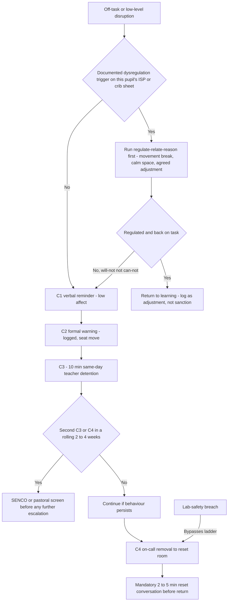

# Department Operating Manual 02 — The Behaviour System, Made Operational

*Level below the blueprint. Section 3 (structure-operations) sets the whole-school warm-strict position and its guardrails; Section 0 (canon) fixes the numbers. This document is what the science department — and any department — actually does minute to minute: the classroom routine, the exact C1–C4 ladder with the words staff say, the centralised detention and on-call/reset-room machinery, the praise economy, and the repair conversation. The worked example is science (Adam's KS3 TLR3); the model generalises. Grounded in research/19 (behaviour, operational) and research/21 (SEND, classroom-level).*

---

## 1. The classroom routine (the thing that prevents 90% of the ladder)

Behaviour is mostly won before a warning is ever needed. The department runs one identical arrival-to-exit sequence in every lab, every lesson, taught to automaticity in the Year 7 bootcamp and re-taught each term (research/19; [Michaela behaviour policy, Sept 2025](https://michaela.education/wp-content/uploads/2025/09/Behaviour-Policy-September-2025.pdf)).

- **Line-up & meet-and-greet.** Pupils line up in silence outside the lab. The teacher stands on the threshold, greets by name, and does a live equipment/uniform glance. Script: *"Morning, Aisha — good to see you. In you come, Do-Now started."* This is the single highest-leverage minute: it is warm (named, positive) and strict (silent, checked) in the same breath.
- **Do-Now within 60 seconds.** A printed 5-question retrieval starter is already on the desk (last lesson, last topic, last term, plus a hinge question). Pupils write in silence for 5 minutes while the teacher takes the register and eyeballs who cannot start — the first live SEND read of the lesson (research/21's "assess" step of APDR).
- **Transitions are scripted, not negotiated.** Practical-work transitions in a lab carry real risk, so they run on a countdown and a fixed instruction: *"In silence, stand, push in chairs, collect goggles from the front bench, back to your seat. Go."* No milling, no queue at a Bunsen.
- **Exit is deliberate.** Pupils pack down, stools under, benches clear, dismissed by table in silence. The teacher stands at the door again — a second meet-and-greet, closing warm. Low-level disruption costs roughly **7 minutes of every 30 taught** and has not materially improved since 2022 ([DfE National Behaviour Survey 2024/25](https://assets.publishing.service.gov.uk/media/691dd17a513046b952c50093/National_behaviour_suvery_report_2024_to_2025.pdf); via `research/19` and `research/04`); the routine exists to claw that time back before any consequence is issued.

Morning Meeting (08:00–08:25, canon) does the same job at year-group scale — retrieval, drill, culture reset, appreciations pushed to families — so the department inherits calm pupils, not a cold start.

---

## 2. The consequence ladder — exact steps and exact words

The department adopts the dominant national **C1–C4 structure** (research/19: recurs near-verbatim across Caldew, Queens', Wordsley, Bournside). C1–C2 are **teacher-owned**; C3–C4 are **centrally run** — this split gives teachers everyday judgement while guaranteeing certainty at the serious end and protecting their time. Certainty beats severity: the deterrent is the near-100% chance of a small consequence, not the size of a rare big one.

| Step | What it is | Who runs it | The script |
|---|---|---|---|
| **C1** | Verbal reminder, no record | Teacher | *"Sam, C1."* Said flat, low-affect, then look away — not an invitation to argue. |
| **30-sec intervention** | For a pupil who *can't start*, not *won't* | Teacher | *"I've noticed you're finding it hard to get going. I need you to start question one. I know you can because you nailed the last one. I'll come back in two minutes."* ([Paul Dix, via research/19](https://www.teachwire.net/news/paul-dix-how-to-be-an-emotionally-consistent-teacher/)) |
| **C2** | Formal warning, logged (ClassCharts/Arbor), seat move if needed | Teacher | *"Sam, that's a C2 — it's logged. I need you facing this way, working in silence. Thank you."* |
| **C3** | 10-min same-day detention at break/lunch, logged centrally | Teacher issues, centrally visible | *"Sam, C3 — ten minutes at break with me today. We'll reset and you carry on."* |
| **C4** | On-call: removal to reset room + centrally-run 30–60 min detention | Non-teaching on-call staff | *"Sam, that's C4. Miss Okafor is on her way. Wait by the door, please."* No debate at the door. |
| **Safety override** | Any lab-safety breach (naked flame misuse, chemical/glassware misuse) → straight to removal | Teacher → on-call | *"Stop. Goggles off, step back. This is a safety removal — someone's on their way."* Documented as principled, category-different from talking. |

The safety override is a **departmental** addition, not a replacement for the whole-school ladder — it reads as principled to pupils and to Ofsted case-sampling precisely because it is written down and confined to genuine harm (research/19, design implication 2).

One edge has to be called explicitly, because it is the single place the warm-strict × SEND reconciliation is genuinely ambiguous: **when a documented-dysregulation pupil's meltdown itself produces a safety-critical act** (a flame knocked over mid-shutdown, glassware swept off the bench). The rule is that the physical response is instant and identical — *stop, make safe, remove* — but the **logging** is not: for a pupil with the trigger documented on their ISP/crib sheet, this is recorded as a **welfare removal (physical-safety-driven, no C-code)**, not a sanction, because it is disability-linked involuntary behaviour, not a choice. The safety override is never *suspended* for SEND pupils (that would be the two-tier fudge); it is the **preventative** adjustment that changes — pre-agreed bench-distant seating, an early-exit signal, a modified practical role (`department/04-send-in-the-department.md`) — so the override protects the room without ever becoming a punishment recorded against a disability. A genuine choice (throwing equipment in temper, not shutdown) still earns the C-code. This keeps the single public standard on *safety* while keeping the *sanction* off involuntary behaviour.

### The ladder as a flowchart — with the SEND decision points visible

The two diamonds are the whole argument of this document, rendered as machinery: an adjustment check **before** C1, and a graduated-response screen **before** escalation past a repeat C3/C4 — both hard-wired, both documented, neither left to the mood of whoever is in the room.

---

## 3. Reconciling warm-strict consistency with SEND adjustment — the argument, not the assertion

This is the document's central problem: run one public standard for a ~45%-FSM, high-SEND intake (SEN support alone is **14.8% of pupils** nationally, [DfE 2025/26](https://explore-education-statistics.service.gov.uk/find-statistics/special-educational-needs-in-england/2025-26)) without it becoming either (a) a two-tier fudge where different children visibly get different rules, or (b) a SEND-exclusion machine. The stakes are measured: SEN-support pupils are permanently excluded at roughly **3.5×** and suspended at roughly **4×** the no-SEN rate ([DfE autumn 2024/25](https://explore-education-statistics.service.gov.uk/find-statistics/suspensions-and-permanent-exclusions-in-england/2023-24)), and SEND/FSM pupils are ~2× more likely to be internally isolated *even controlling for behaviour* ([Thornton 2026, via research/19](https://bera-journals.onlinelibrary.wiley.com/doi/10.1002/berj.70049)). "Consistency" as commonly practised is already failing this test — the adjustment, if it happens at all, happens *after* the exclusion, not before the behaviour response.

The reconciliation rests on four moves, all upstream of the sanction:

1. **The adjustment lives in the teaching, not in a carve-out.** Michaela's own reconciliation is upstream: heavy pre-emptive scaffolding (My-Turn/Your-Turn, cold-call with think time, knowledge organisers) reduces the number of moments a SEND pupil is set up to fail an expectation in the first place ([research/21](https://educationendowmentfoundation.org.uk/news/moving-from-differentiation-to-adaptive-teaching)). The department bakes the EEF **five-a-day** — explicit instruction, cognitive/metacognitive strategies, scaffolding, flexible grouping, assistive technology — into the shared lesson booklet at *planning* time ([EEF SEND guidance](https://educationendowmentfoundation.org.uk/education-evidence/guidance-reports/supporting-high-quality-teaching-for-pupils-with-send)), so the adjustment is designed in, not improvised live.

2. **Adjustments are written down and pre-authorised per pupil — this is what makes it one system, not two.** On the Dixons model, each SEND pupil has a named, pre-agreed list (permitted movement break, fidget tool, modified response to a specific trigger) signed off by **SENCO + HoD**, attached to the digital ISP, and shared with *every* teacher who teaches them ([research/21](https://www.dixonsat.com/why/culture)). Because the adjustment is transparent and applied identically by every adult, it is the *opposite* of ad-hoc discretion. A two-tier system is one where the rule bends for whoever complains loudest in the moment; this is one rule, individually calibrated in advance and visible to all — the reasonable-adjustment duty under the **Equality Act 2010** discharged as a system property, not a favour.

3. **Separate dysregulation from defiance in the policy text itself.** The behaviour code carries a written **regulate–relate–reason** sequence (Star Academies model) for a *documented* dysregulation trigger, distinct from — and never a substitute for — the C1–C4 ladder for behaviour that is not disability-linked. This is the left branch of the flowchart. Crucially it is not "different rules for different children": it is the same code recognising that a sensory overload or demand-avoidance episode is not a conduct choice, so the correct first response is de-escalation, with the sanction ladder still available if the behaviour is in fact will-not, not can-not.

4. **Instrument the gap and make it a first-class KPI.** The reconciliation is *claimed* to work; whether it does is an empirical question the department answers every half-term. C3/C4/on-call/reset-room data is published split by FSM/SEND/ethnicity/sex to HoD and governors (research/19, implication 5). A widening or static SEND removal gap is the signal that "consistency" has drifted into "no adjustment"; a narrowing gap with stable overall behaviour is the signal it is working. Canon reinforces this with a **graduated-response SEND check hard-wired before any second suspension**, a **reward:sanction ratio tracked weekly at ≥4:1**, and a **SENCO co-owning the behaviour policy's SEND clauses** — the reconciliation fails whenever behaviour and SEND run as two systems that only meet at exclusion.

**Honest flag (research/21):** there is essentially no RCT evidence for "how to run a consistent behaviour system with disability adjustments." The four moves above are operator consensus (Dixons, Star, Michaela, The Difference — which halved suspensions in a year by training the *whole* SLT in inclusion), not proven design. We adopt them for coherence with the causal evidence on consistency, routines and praise-weighting, and we measure relentlessly rather than assert.

---

## 4. Centralised detention, on-call and the reset room

Enforcement discretion is removed from the individual teacher at the serious end. C3/C4 run centrally, same-day, parents notified same-day. This cuts perceived inconsistency *and* the workload of chasing detentions — the most-cited lever among high performers, evidence-thin but mechanistically sound ([Parents & Teachers for Excellence](https://parentsandteachers.org.uk/a-centralised-detention-system/)).

```mermaid
flowchart LR
    T["Teacher flags C4 via app or radio"] --> OC["On-call rota - non-teaching senior or pastoral staff, one per period"]
    OC --> ARR["Arrives - practitioner target under 5 min, unverified"]
    ARR --> REM["Removes pupil to centrally staffed reset room"]
    REM --> WORK["Pupil continues the same lesson work - curriculum-continuous, not idle isolation"]
    WORK --> DET["Centrally-run 30 to 60 min detention, parents notified same day"]
    DET --> RC["Reset conversation - 4 questions, 2 to 5 min"]
    RC --> RET["Return to next lesson"]
    RET --> LOG["Logged as a monitored classroom removal - statutory from 26 July 2026"]
    LOG --> DASH["Half-termly equity dashboard - split FSM, SEND, ethnicity, sex"]
```

- **Who:** a rota of non- or partially-timetabled senior/pastoral staff, one named person per period, so a C4 is *never* unanswered mid-lesson. This is a real headcount cost that scales with C4 volume — it is staffed to *measured* volume, not intuition, sized off the first half-term's logs (research/19, implication 3).
- **Where:** a staffed, curriculum-continuous **reset room** — canon's time-limited (~6-week), staffed internal support centre with automatic SEND screening on second referral, explicitly *an inclusion unit, not a punitive isolation room*. Pupils do the lesson's work there; they do not sit idle.
- **Throughput & follow-up:** every C3/C4 is logged from day one — a **statutory monitored category from 26 July 2026** ([DfE new guidance, via HCR Law](https://www.hcrlaw.com/news-and-insights/dfe-issues-new-statutory-guidance-on-suspensions-and-school-exclusions/)). A **second C3/C4 in a rolling 2–4 week window** triggers a SENCO/pastoral screen, not automatic harsher sanction — because 78% of permanent exclusions go to pupils with SEN, in-need status or FSM (research/19), so repeat removal is a *diagnostic signal* before it is a discipline problem.

---

## 5. The reset / repair conversation

Removal ends with a **mandatory 2–5 minute reset**, run before the pupil returns — restorative *on top of* the consequence, never instead of it. Restorative-as-replacement has null-to-negative RCT evidence (LEIP); restorative-as-add-on has small positive effects (research/19). Fixed 4-question script:

1. *What happened?* 2. *Who was affected?* 3. *What needs to happen now?* 4. *How do we put it right?*

Kept short and low-affect, at the pupil's level, not a re-prosecution. Its ceiling is honest: the INCLUSIVE/Lancet trial found only a small bullying effect (−0.08) — the conversation repairs the relationship so the pupil can re-enter class regulated; it is not itself the accountability system.

---

## 6. The praise / reward economy

The DfE Behaviour Hubs evaluation's central finding: the most-improved schools increased focus on **rewarding positive behaviour, not harsher sanctions** ([Tes](https://www.tes.com/magazine/news/general/rewarding-good-behaviour-key-school-success-dfe-hubs-evaluation-finds)). Operationally, department practice sits *under*, never competing with, the whole-school merit economy:

- **Behaviour-specific praise at ≥4:1** positive:corrective (~6 statements/15 min) — the one genuinely ABA-evidenced, learning-walk-measurable metric here ([SkillBuilders ABA](https://www.skillbuildersaba.com/blog/how-to-use-behavior-specific-praise-effectively)). Named, not generic: *"That's resilience — you stuck with the tricky calculation,"* not *"well done."*
- **Department layers:** science "star of the week," positive postcards/app appreciations home (pushed via Morning Meeting), merits tied to named behaviours — all feeding the whole-school system, never a parallel currency.
- **Tracked weekly** at the ≥4:1 target (canon); a ratio slipping below it is an early-warning that the department is drifting sanction-heavy before the suspension data ever shows it.

---

## Sources

- Michaela Community School, Behaviour Policy (Sept 2025) — https://michaela.education/wp-content/uploads/2025/09/Behaviour-Policy-September-2025.pdf
- Dixons Academies Trust, culture / warm-strict — https://www.dixonsat.com/why/culture
- Paul Dix / 30-second intervention scripts (Teachwire) — https://www.teachwire.net/news/paul-dix-how-to-be-an-emotionally-consistent-teacher/
- Parents & Teachers for Excellence, centralised detention case study — https://parentsandteachers.org.uk/a-centralised-detention-system/
- DfE new statutory suspension/exclusion guidance (in force 26 July 2026), via HCR Law — https://www.hcrlaw.com/news-and-insights/dfe-issues-new-statutory-guidance-on-suspensions-and-school-exclusions/
- DfE, Suspensions and permanent exclusions in England, autumn 2024/25 — https://explore-education-statistics.service.gov.uk/find-statistics/suspensions-and-permanent-exclusions-in-england/2023-24
- DfE, Special educational needs in England 2025/26 — https://explore-education-statistics.service.gov.uk/find-statistics/special-educational-needs-in-england/2025-26
- EEF, Supporting high-quality teaching for pupils with SEND (five-a-day) — https://educationendowmentfoundation.org.uk/education-evidence/guidance-reports/supporting-high-quality-teaching-for-pupils-with-send
- EEF, moving from differentiation to adaptive teaching — https://educationendowmentfoundation.org.uk/news/moving-from-differentiation-to-adaptive-teaching
- EEF, Making Best Use of Teaching Assistants — https://educationendowmentfoundation.org.uk/education-evidence/guidance-reports/teaching-assistants
- Tes, DfE Behaviour Hubs — rewarding good behaviour key to success — https://www.tes.com/magazine/news/general/rewarding-good-behaviour-key-school-success-dfe-hubs-evaluation-finds
- SkillBuilders ABA, behaviour-specific praise — https://www.skillbuildersaba.com/blog/how-to-use-behavior-specific-praise-effectively
- DfE, National Behaviour Survey 2024/25 (lost-learning-minutes figure) — https://assets.publishing.service.gov.uk/media/691dd17a513046b952c50093/National_behaviour_suvery_report_2024_to_2025.pdf
- SecEd, autumn 2024 suspensions data — https://www.sec-ed.co.uk/content/news/school-suspensions-autumn-2024-dfe-data
- Thornton (2026) internal-exclusion study (BERJ) — https://bera-journals.onlinelibrary.wiley.com/doi/10.1002/berj.70049
- Cross-reference: research/19 (behaviour, operational) and research/21 (SEND, classroom practice) in this project.
