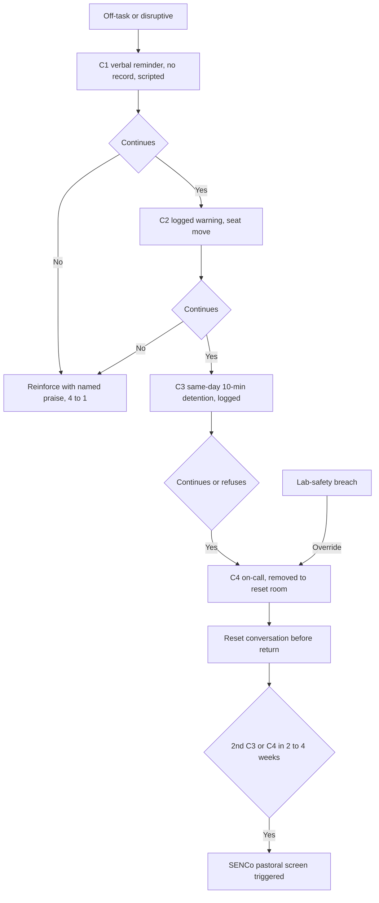
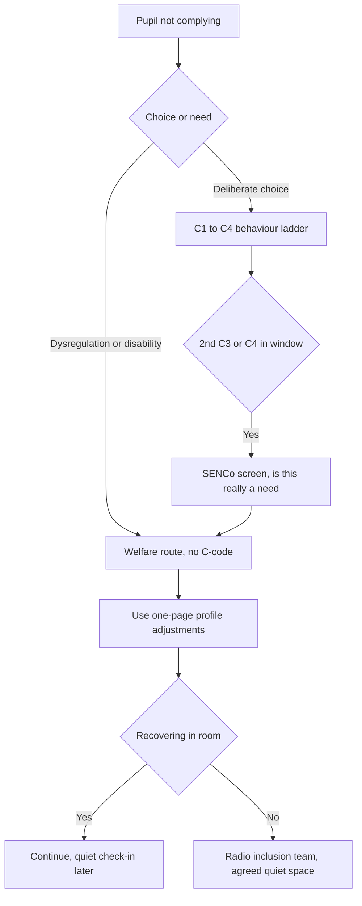
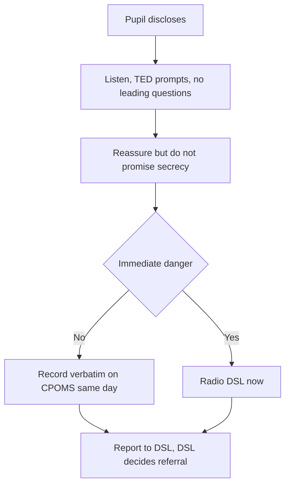

# Department Operating Layer — 03: Behaviour Scenario Bank

*Ten concrete behaviour situations a teacher in this school will actually face, each resolved **through** the C1–C4 system defined in `02-behaviour-system.md`, not by one heroic teacher. Science (Adam's KS3 TLR3) is the worked example; the model generalises to any department. Read alongside canon (`blueprint/0-canon.md`) and the whole-school culture layer (`blueprint/3-structure-operations.md`). This document goes one level down: the words, the moves, the escalation actually taken.*

## The system these scenarios run on

Every scenario below leans on infrastructure that exists **before** the lesson starts, so the response is the system's, not the individual's:

- **The C1–C4 ladder** — C1 verbal reminder (no record), C2 logged formal warning, C3 10-minute same-day teacher detention, C4 on-call removal to a centrally-staffed reset room + centrally-run detention (30–60 min) with a mandatory reset conversation before return. Teacher-owned at C1/C2; centrally-triggered at C3/C4 ([Michaela policy Sept 2025](https://michaela.education/wp-content/uploads/2025/09/Behaviour-Policy-September-2025.pdf); [Bournside ladder 2025-26](https://www.bournside.com/assets/Policies-/Attendance-and-Behaviour/Ladder-of-consequences-2025-26.pdf)).
- **A science safety override** — any lab-safety breach skips the ladder straight to removal, documented so it reads as principled, not inconsistent.
- **On-call rota** — a non-teaching senior/pastoral staff member answers a C4 within a target <5 min (a practitioner aspiration we measure locally, not an evidenced benchmark).
- **The Mountain Rescue team** — one multidisciplinary inclusion/pastoral/safeguarding department under a DSL, with a SENCo on SLT (`blueprint/3-structure-operations.md`).
- **Crew** — every pupil has one consistent adult (crew of ~12) across five years, so "who knows this child" is never in doubt.
- **A hard-wired SENCo/pastoral screen on the second C3/C4 in any rolling 2–4 week window**, and a graduated-response SEND check before any second suspension (canon) — because 78% of permanent exclusions go to pupils with SEN, in-need status or FSM (`research/04-behaviour-culture.md`).
- **Reward economy** — behaviour-specific praise tracked to a ≥4:1 positive:corrective ratio (canon; [ABA synthesis](https://www.skillbuildersaba.com/blog/how-to-use-behavior-specific-praise-effectively)).

## The scenarios

### 1. Persistent low-level disruption

**Situation.** Year 8 mixed-attainment class, mid-lesson. **Pupil:** Kayden keeps calling out answers, tapping a ruler, turning to talk — the ~7-minutes-lost-per-30 pattern the ladder exists to suppress ([National Behaviour Survey 2024/25](https://www.gov.uk/government/publications/national-behaviour-survey-2024)). **Script:** "Kayden, C1" — quiet, non-judgemental, eye contact, no pause for debate; then, ten seconds later, narrate the positive elsewhere ("Priya, straight into question two — thank you"). Continues: "Kayden, that's a C2, I'm moving you here" (logged on Bromcom/ClassCharts, seat moved calmly). **Escalation:** stops at C2; no detention needed. **SEND/safeguarding:** none flagged; but the log now exists so a pattern is visible to HoD. **Restorative:** 20-second doorway line at the end — "Better second half. See you tomorrow." **What the system did:** the scripted, low-affect ladder let the teacher correct three times in 40 seconds without raising voice, arguing or losing the room — certainty over severity ([Paul Dix / Teachwire](https://www.teachwire.net/news/paul-dix-how-to-be-an-emotionally-consistent-teacher/)).

### 2. Flat refusal / defiance

**Situation.** Year 10, pupil refuses to start the Do Now, arms folded: "I'm not doing it." **Script (30-second intervention, fixed pace):** "I've noticed you're finding it hard to get going. I need you to write the date and question one. I know you can because you nailed the required-practical writeup last week. I'll come back in two minutes." Walk away — do not stand over them, which turns a private refusal into a public showdown. Return in two minutes; if still refusing, "That's a C2. I'll check again shortly." **Escalation:** if refusal holds through C3, C4 on-call — the pupil is removed, not the lesson derailed. **SEND/safeguarding:** flat refusal is often a demand-avoidance or dysregulation signal — the crew leader checks in same day; if it recurs, the SENCo screen catches it. **Restorative:** reset conversation before return (What happened? / Who was affected? / What needs to happen? / How do we put it right?), 2–5 min. **What the system did:** the script gives the pupil an exit ramp and take-up time, and the walk-away denies an audience — the removal, when needed, is the system's not a personal battle.

### 3. Phone out in lesson

**Situation.** Year 9; pupil filming a classmate. **Script:** "Phone in the box now, please — thank you" (single, calm, per the whole-school no-phones default). If handed over: log C2, done. If refused: "That's now a refusal — C3, and I'm calling it in." **Escalation:** refusal to surrender + filming a peer = safeguarding dimension, so straight to C4 on-call; DSL notified because a recording of a child now exists. **SEND/safeguarding:** possible image-sharing/child-on-child abuse — DSL logs on CPOMS, reviews whether the image was shared. **Restorative:** phone returned end-of-day to parent/carer per policy; reset conversation covers the harm to the filmed pupil. **What the system did:** a single non-negotiable phone routine means no in-the-moment negotiation, and the safeguarding hand-off is automatic, not dependent on the teacher spotting the risk.

### 4. ADHD pupil unable to settle

**Situation.** Year 7; pupil with diagnosed ADHD (on the SEND register, EHCP-adjacent) out of seat, fidgeting, blurting — not defiant, dysregulated. **Script:** use the pupil's known adjustments *first*, before any C-code: "Marcus, movement break — take the register to the office and come back to question one." Offer the fidget tool named in his one-page profile. **Escalation:** the ladder is **paused, not skipped** — canon requires graduated, SEND-plan-documented enforcement of the single public standard, not a demerit for an involuntary behaviour, which would breach Equality Act reasonable-adjustment duties (`blueprint/3-structure-operations.md`). Only a genuine choice (e.g. throwing equipment) earns a C-code. **SEND/safeguarding:** adjustments are pre-agreed on the profile, so this is planned provision, not improvisation. **Restorative:** none needed — this is regulation, not repair. **What the system did:** the one-page profile put the adjustment in the teacher's hand before the lesson, and the "no demerit for disability-related behaviour" rule (built into the system) protects Marcus from a punishment spiral that the national ~4× SEND suspension gradient (`research/21`, and `02-behaviour-system.md` §3) shows is the default drift.

### 5. Autistic pupil heading into meltdown/shutdown after a change

**Situation.** Cover teacher, room changed at short notice; an autistic Year 8 pupil who needs predictability starts rocking, covering ears, going quiet and unresponsive — a **shutdown** (inward freeze), which is easy to misread as "sulking" ([Autism Society, meltdowns & shutdowns 2025](https://autismsociety.org/wp-content/uploads/2025/07/AutismSociety_Autistic-Meltdowns-Shutdowns_2025-06V2F_Digital.pdf)). **Script (low-arousal):** reduce demands — stop instructing; drop to a low voice, sideways not face-on: "Take your time. Your card's on the desk when you're ready." Do not crowd or touch; do not stack questions ([Child Mind Institute](https://childmind.org/article/how-to-de-escalate-an-autistic-meltdown/); [Timian](https://timian.co.uk/de-escalation-strategies-to-support-autism-spectrum-disorders/)). **Escalation:** this is a **welfare, not a behaviour, route** — no C-codes. Use the profile's agreed exit card / quiet-space plan; radio the inclusion team for the sensory space if he can't recover in-room. **SEND/safeguarding:** the change was the trigger — predictability is *more* protective for autistic pupils, not less (`blueprint/3-structure-operations.md`); the incident is logged so the trigger (unflagged room change) is fixed system-wide. **Restorative:** later, when regulated, a low-key check-in with the key worker — not an interrogation. **What the system did:** the profile, the pre-planned quiet space and the "welfare route ≠ behaviour route" split meant a cover teacher who'd never met the pupil still did the right thing; and the logged trigger drives a fix to cover protocols.

### 6. Peer conflict escalating toward a fight

**Situation.** Year 9 practical; two boys squaring up over a shared bench, voices rising, one stands. **Script:** loud, firm, whole-class first for safety — "Stop. Both of you, sit. Everyone else, eyes on your work." Then separate: "Jordan, out to the corridor with me. Aaron, stay." Never physically get between them unless trained. **Escalation:** immediate C4 on-call — a second adult removes one pupil so they are never walked together; both to separate reset spaces. In a lab, the safety override applies the instant equipment could become a weapon. **SEND/safeguarding:** DSL screens for bullying history, county-lines/exploitation markers, or a safeguarding driver behind the flashpoint. **Restorative:** a **facilitated** restorative conversation once both are calm and *only if both consent* — restorative-as-add-on has small positive effects, but it repairs on top of the consequence, never instead of it (the LEIP RCT of restorative-as-replacement was null-to-negative; `research/04-behaviour-culture.md`). **What the system did:** the on-call rota guaranteed a second adult within minutes so the two were physically separated by the system, not left to one teacher managing both.

### 7. Verbal abuse directed at the teacher

**Situation.** Year 11 mock-results stress; a pupil swears directly at the teacher — "This is s***, you're a rubbish teacher." **Script:** do not personalise, do not swear back, do not send a parting shot. Flat and brief: "That's a C4. On-call is coming. Step outside please." Then narrate nothing further — deny the audience. **Escalation:** verbal abuse of staff is a straight C4 (bypasses lower rungs) and, per whole-school policy, is likely a **fixed-term suspension** decision for SLT — but canon hard-wires a **graduated-response SEND/communication screen before any second suspension** (`blueprint/3-structure-operations.md`). **SEND/safeguarding:** sudden aggression from a usually-coping pupil is a flag — is something happening at home, is this exam-driven, is there an unmet communication need? Crew leader + DSL informed same day. **Restorative:** a genuine repair conversation (not a forced apology) is a condition of return; the teacher chooses whether to attend or have it mediated. **What the system did:** centralised C4 handling meant the teacher issued the consequence but did **not** administer it or negotiate the sanction — protecting both the standard and the teacher's workload and dignity, and the pre-suspension screen stops a one-off blow-up becoming an exclusion statistic.

### 8. Usually-compliant pupil suddenly withdrawn (internalising — easy to miss)

**Situation.** A quiet, reliable Year 8 girl stops contributing, hands in blank work, head down, flinches at the bell — no rule broken, so **the behaviour ladder never triggers**. This is the failure mode the ladder cannot see. **Script:** low-key, private, at the end: "I've noticed you've seemed a bit flat this week and your work's not like you. Nothing's in trouble — I just wanted to check you're OK." Whatever the answer, act on the noticing. **Escalation:** **not** a behaviour route at all — a **pastoral flag**: log a wellbeing concern on the system, tell the crew leader same day, who joins the dots with attendance, other subjects and family-support. **SEND/safeguarding:** withdrawal is a recognised indicator of neglect, abuse, young-carer load, bereavement or mental-health need — if anything the pupil says or shows crosses the threshold, it becomes scenario 9. **Restorative:** n/a; this is early help, not repair. **What the system did:** crew (one adult who knows the child across five years) plus a wellbeing-flag channel that runs *parallel* to the behaviour system is the only reason an internaliser — invisible to a consequence ladder — gets caught. The 4:1 praise culture also makes "not like you" a noticeable deviation.

### 9. Safeguarding disclosure mid-lesson

**Situation.** During a quiet task a Year 7 pupil says, low: "Miss, I don't want to go home, he hits my mum and sometimes me." **Script:** stop, listen, do not interrogate. Use TED prompts only ("Tell me... Explain... Describe..."), never leading or "why" questions. Reassure without over-promising: "Thank you for telling me. You've done the right thing. I have to share this with [DSL] so we can help keep you safe — I can't keep it a secret, but I'll only tell people who need to know." **Never promise confidentiality** ([KCSIE 2025 summary, CPOMS](https://www.cpoms.co.uk/kcsie-2025-key-safeguarding-changes-and-updates/)). **Escalation:** finish the lesson calmly if you can; record verbatim (child's own words, dated, signed) on CPOMS and report to the DSL **immediately/same day** — do not wait. If risk is imminent, radio the on-call/DSL now. **SEND/safeguarding:** this *is* the safeguarding route — it overrides everything, including any behaviour context. **Restorative:** n/a. **What the system did:** every teacher is KCSIE-trained to the "reassure, don't promise, record, refer" script, the DSL sits inside the Mountain Rescue team reachable by radio, and CPOMS gives an immediate confidential channel — so a disclosure to any adult reaches the DSL the same day regardless of who heard it.

### 10. Whole-class low-level drift, Friday period 5

**Situation.** Last lesson of the week; the class is warm, chatty, slow to start — collective, not one culprit. **Script:** reset the routine, don't sanction the room. "Pens down, tracking me. We're doing the last twenty minutes properly. Do Now on the board, silent, 60 seconds — go." Reassert the entry/Do-Now automaticity, then load a high-success, retrieval-heavy task so momentum returns. Catch and name three pupils getting it right (the ≥4:1 lever doing real work here). Only individuals who then persist get C1s. **Escalation:** rarely past C1/C2; if two or three individuals drift, code them individually so the *class* isn't collectively punished. **SEND/safeguarding:** none — this is a routine-strength issue, not a pupil-need issue. **Restorative:** end on a genuine positive to protect Monday's re-entry — "Strong finish. That's how we start next week." **What the system did:** because entry and Do-Now are *taught routines rehearsed to automaticity* (not Friday-dependent willpower), the teacher had a system to re-trigger; the reward ratio and knowledge-rich, high-success task design mean the fix is re-engagement, not escalation — which is exactly where drift is cheapest to reverse ([Behaviour Hubs: reward-weighting, not harsher sanctions](https://www.tes.com/magazine/news/general/rewarding-good-behaviour-key-school-success-dfe-hubs-evaluation-finds)).

## The thread through all ten

In every scenario the decisive move was made *before* the lesson: a shared C1–C4 script, a welfare route that runs beside (not through) the behaviour ladder, a crew adult who knows the child, an on-call rota that guarantees a second adult, a SENCo screen that fires on the second referral, and a DSL reachable by radio. That is what stops these being ten stories about one skilled teacher and makes them ten instances of one working system — which is the point, because consistency and implementation quality, not the specific policy, are what the evidence says actually move behaviour (`research/04-behaviour-culture.md`).

## Sources

- Michaela Community School, Behaviour Policy (Sept 2025): https://michaela.education/wp-content/uploads/2025/09/Behaviour-Policy-September-2025.pdf
- Bournside School, Ladder of Consequences 2025-26: https://www.bournside.com/assets/Policies-/Attendance-and-Behaviour/Ladder-of-consequences-2025-26.pdf
- Teachwire, Paul Dix scripts and the 30-second intervention: https://www.teachwire.net/news/paul-dix-how-to-be-an-emotionally-consistent-teacher/
- SkillBuilders ABA, behaviour-specific praise (4:1–5:1): https://www.skillbuildersaba.com/blog/how-to-use-behavior-specific-praise-effectively
- DfE National Behaviour Survey 2024/25: https://www.gov.uk/government/publications/national-behaviour-survey-2024
- CPOMS, KCSIE 2025 key safeguarding changes: https://www.cpoms.co.uk/kcsie-2025-key-safeguarding-changes-and-updates/
- Autism Society, Autistic Meltdowns & Shutdowns (2025): https://autismsociety.org/wp-content/uploads/2025/07/AutismSociety_Autistic-Meltdowns-Shutdowns_2025-06V2F_Digital.pdf
- Child Mind Institute, How to de-escalate an autistic meltdown: https://childmind.org/article/how-to-de-escalate-an-autistic-meltdown/
- Timian Learning & Development, de-escalation strategies for ASD: https://timian.co.uk/de-escalation-strategies-to-support-autism-spectrum-disorders/
- Tes / DfE Behaviour Hubs evaluation, rewarding good behaviour: https://www.tes.com/magazine/news/general/rewarding-good-behaviour-key-school-success-dfe-hubs-evaluation-finds
- Cross-reference: Perfect School research brief 19 (`research/19-behaviour-systems-operational.md`) and brief 04 (`research/04-behaviour-culture.md`)
