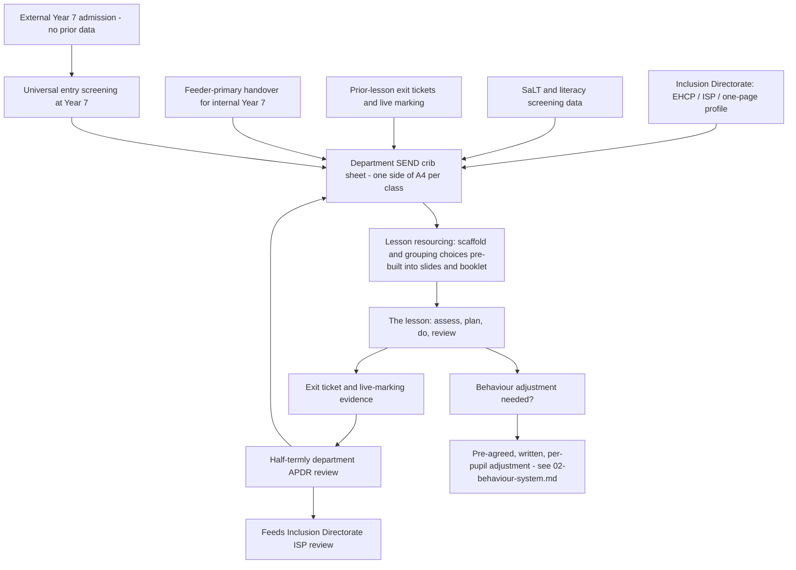

# Department Operations 04 — SEND in the Department

*Level: department and classroom, science worked example (KS3 curriculum lead, TLR3). One level below `blueprint/4-send-inclusion.md`, which sets the whole-school Inclusion Directorate, bases and TA-reallocation policy — this document does not repeat those decisions, it operationalises them inside a subject department. Companion document: `02-behaviour-system.md` (department behaviour ladder) — see the reasonable-adjustments cross-reference below. Evidence: `research/21-send-classroom-practice.md`, with supporting detail from `research/03-send-evidence.md` and `research/19-behaviour-systems-operational.md`.*

## Scale, stated plainly

Science is taught to all 900 secondary pupils (6FE, 180/year, `0-canon.md`), in classes of roughly 30. On the canonical planning assumption of 25–40% identified SEND across the school (`4-send-inclusion.md`), the science department is teaching somewhere between **225 and 360 pupils with an identified need at any one time** — 8 to 12 pupils in every class of 30, not a handful of exceptional cases. Two-thirds of each Year 7 intake (120 of 180) arrive from outside the school's own primary, so for most of these pupils the department has no institutional memory of what has worked before; the information-flow system below exists precisely because the "all-through advantage" does not apply to them (`0-canon.md`, `4-send-inclusion.md`). This is why SEND provision in science cannot be a SENCO-run add-on: at this density, it is the department's core operating model, run by the class teacher, in the lesson, every lesson.

## The lesson is where APDR actually runs

The whole-school graduated approach (assess–plan–do–review) is a termly cycle at Inclusion Directorate level. Inside a single 50–60 minute science lesson it has to compress into something a teacher runs unconsciously, dozens of times a lesson, without pulling anyone out of the room (`research/21-send-classroom-practice.md`):

| Phase | What it looks like in a KS3 science lesson | Timing |
|---|---|---|
| **Assess** | Retrieval starter / hinge question on the previous lesson's key term (e.g. "define independent variable") — mini-whiteboards up on 3, cold-call to check, not just the fast hands | First 5 minutes |
| **Plan** | The scaffold choice was made *before* the lesson, at resourcing stage, not invented live — the department crib sheet (below) already says which pupils in this class need a worked example, a writing frame, or a pre-taught keyword list for today's practical | Built into the lesson slide/booklet, not the teacher's head |
| **Do** | Explicit instruction (model the method on the visualiser, "my turn/your turn" on the calculation), scaffold deployed live — sentence starters on the practical write-up, a partially completed results table for named pupils, TA prompting-not-telling at the bench | Main teaching + practical, 30–40 minutes |
| **Review** | Exit ticket or live marking during the plenary shows whether the scaffold worked for the pupils it was aimed at — this is the data that updates next lesson's plan and, at half-termly intervals, the crib sheet | Final 5 minutes |

The unit of analysis that whole-school SEND policy tends to skip is exactly this: the cycle has to survive contact with one teacher, 30 pupils, a Bunsen burner, and 55 minutes. That is only possible if the "plan" step happens at resourcing time, not in the room.

## Five-a-day, made subject-specific for science

The EEF's five adaptive-teaching strands ([EEF Five-a-day guidance](https://educationendowmentfoundation.org.uk/education-evidence/guidance-reports/supporting-high-quality-teaching-for-pupils-with-send)) are the department's standing toolkit, built into the shared KS3/KS4 lesson template so every teacher — ECT to TLR3 — draws on the same repertoire:

| Strand | Generic EEF definition | Science department application |
|---|---|---|
| **Explicit instruction** | Model → guided practice → independent practice, not discovery-first | Method demonstrated on the visualiser before any pupil touches equipment; worked examples for calculations (e.g. moles, resultant force) shown step-by-step before independent questions |
| **Cognitive and metacognitive strategies** | Pupils plan, monitor, self-evaluate their approach | Pupils predict-then-check in practicals ("what do you expect to happen, and why?"); a self-check rubric before handing in a write-up ("have I labelled both axes? Included units?") |
| **Scaffolding** | Temporary supports, explicitly withdrawn as competence grows | Sentence starters and partially-completed method/results tables for named pupils only, faded across the term as the crib sheet is reviewed; never a permanent parallel worksheet |
| **Flexible grouping** | Formed around a current shared need, disbanded once met | A same-lesson group re-taught the graph-plotting convention while the rest proceed to analysis — grouped by *today's* gap, not a fixed set they never leave |
| **Technology** | Assistive tools targeted at a specific access barrier | Text-to-speech for extended-writing tasks, word-processed practical write-ups for pupils with a fine-motor or processing-speed need, pre-loaded keyword glossaries on tablets for EAL/SLCN pupils |

The evidence for each strand is strong; the claim that bundling them *as* "five-a-day for SEND" is itself trialled is not (`research/21-send-classroom-practice.md`) — the department treats this as the best available synthesis, not a proven package, and reviews what is and isn't working at the half-termly APDR review below.

## Scaffolding is not differentiation-by-worksheet

The department bans permanently separate "must/should/could" task sheets and simplified content for the SEN-support majority, in line with the whole-school position (`4-send-inclusion.md`). The distinction that matters in a science lesson: every pupil investigates the same variable, answers the same 6-mark question, is held to the same curriculum objective — the *support* to get there varies and is time-limited. A pupil struggling with extended writing gets a writing frame for the conclusion, not a shorter, easier question; a pupil struggling with the practical method gets a partially sequenced method card, not a "simplified" experiment. The frame is withdrawn as soon as the crib-sheet review shows it is no longer needed — the opposite of a worksheet a pupil is handed every lesson indefinitely.

## TA deployment: killing the Velcro pattern by job design

Following the whole-school TA reallocation (`4-send-inclusion.md`) and the evidence it rests on — unstructured 1:1 TA support produces roughly zero or negative progress, while structured, time-limited TA-delivered intervention adds **+3–4 months** (up to +6 for 1:1), consistent with the EEF's seven TA-deployment recommendations ([EEF TA guidance](https://educationendowmentfoundation.org.uk/education-evidence/guidance-reports/teaching-assistants); `research/21-send-classroom-practice.md`) — the science department applies three fixed rules:

1. **TAs are timetabled to a class/year group, not "velcroed" to a named pupil**, except where an EHCP/ISP specifies 1:1 support as a documented requirement. In a 30-pupil class with 8–12 identified needs, one TA circulating to prompt-not-tell across the group reaches more pupils than one TA permanently anchored beside a single desk.
2. **TAs get the week's lesson content, keywords and practical method 48 hours ahead**, not at the classroom door — the single biggest predictor of whether a TA can scaffold understanding rather than just supervise task completion (`research/21-send-classroom-practice.md`; EEF recommendation 4).
3. **Lab technicians run practical prep and H&S; they are not folded into pupil-facing TA roles.** Keeping the two functions distinct protects both — technician time for equipment and risk assessment, TA time for scaffolding — rather than diluting each into the other under timetable pressure.

Any TA-led intervention (e.g. pre-teaching command words or unit vocabulary before a topic starts) runs on a named, scripted, time-limited protocol with entry/exit data, feeding back into the following lesson — never open-ended in-class minding.

## How SEND information reaches the teacher, and changes the lesson

The crib sheet is the hinge in this diagram: it is the one document a cover teacher or new starter can read on day one and apply correctly, without waiting for a briefing (`research/21-send-classroom-practice.md`). It is reviewed at the department's half-termly APDR meeting, owned by the HoD, and lists — per pupil, per class — primary need, current agreed scaffold(s), and current agreed behaviour adjustment(s), side by side. Its two upstream feeds are the Inclusion Directorate's EHCP/ISP/one-page-profile data (top-down) and the department's own exit-ticket and live-marking evidence (bottom-up, generated inside the lesson) — so the crib sheet is never solely a paperwork copy of someone else's file; it is partly written by what actually happens in science lessons. For the external two-thirds of Year 7, who arrive with no institutional history, the crib sheet's first entries come from the universal Year 7 entry screening (`4-send-inclusion.md`), not from a wait for handover data that may never fully materialise.

Digital ISPs (the incoming statutory duty at Targeted/Targeted Plus tier, reviewed at least annually — [Commons Library CBP-10550](https://commonslibrary.parliament.uk/research-briefings/cbp-10550/)) will eventually supply this feed directly; the department builds the crib-sheet habit now, ahead of the 2028 National Inclusion Standards, rather than retrofitting it under inspection pressure.

## Reasonable adjustments and behaviour: cross-reference to 02-behaviour-system.md

Science has one behaviour-specific complication the department behaviour document (`02-behaviour-system.md`) has to reconcile with this one: a lab safety override (any naked-flame or chemical/glassware misuse skips straight to removal, regardless of warning count) can collide with a documented dysregulation trigger for an autistic or ADHD pupil. The resolution is not case-by-case discretion in the moment — it is written in advance. Following the Dixons model (`research/21-send-classroom-practice.md`), every pre-agreed behaviour adjustment on the crib sheet is signed off by SENCO plus HoD and shared with every adult who teaches that pupil, so a TA, cover teacher or technician applies it identically. The Equality Act 2010 duty to make reasonable adjustments sits on the *system*, not on individual staff improvising a response — but it does not suspend the safety override itself; where a documented trigger is likely to produce a safety-critical behaviour during practical work, the pre-agreed adjustment is a *preventative* one (seating away from the demonstration bench, a pre-arranged early exit signal, a modified practical role) decided before the lesson, not a downgraded consequence decided after an incident. This is the same principle brief 21 draws from Star Academies: separate the response to dysregulation from the sanction for defiance, in writing, before the lesson happens (`research/21-send-classroom-practice.md`).

## The department SEND crib sheet, minimum contents

One side of A4 per class, reviewed at each half-termly department APDR meeting, containing for every named pupil: primary need; current agreed scaffold(s) from the five-a-day list above; current agreed behaviour adjustment(s) cross-referenced to `02-behaviour-system.md`; and a review date. No pupil sits on the sheet without a scaffold and a review date attached — a name with neither is the signal that APDR has stalled for that pupil.

## Sources

- EEF, Five-a-day / Special Educational Needs in Mainstream Schools guidance — https://educationendowmentfoundation.org.uk/education-evidence/guidance-reports/supporting-high-quality-teaching-for-pupils-with-send
- EEF, moving from differentiation to adaptive teaching — https://educationendowmentfoundation.org.uk/news/moving-from-differentiation-to-adaptive-teaching
- EEF, Making Best Use of Teaching Assistants guidance report — https://educationendowmentfoundation.org.uk/education-evidence/guidance-reports/teaching-assistants
- EEF Toolkit, Teaching Assistant Interventions — https://educationendowmentfoundation.org.uk/education-evidence/teaching-learning-toolkit/teaching-assistant-interventions
- House of Commons Library, Schools White Paper 2026: SEND Reform, CBP-10550 — https://commonslibrary.parliament.uk/research-briefings/cbp-10550/
- DfE, Suspensions and permanent exclusions in England — https://explore-education-statistics.service.gov.uk/find-statistics/suspensions-and-permanent-exclusions-in-england/2023-24
- DfE, mandatory NPQ for SENCOs transition guidance — https://www.gov.uk/government/publications/mandatory-qualification-for-sencos/transition-to-national-professional-qualification-for-special-educational-needs-co-ordinators
- Internal: `blueprint/0-canon.md`, `blueprint/4-send-inclusion.md`, `research/21-send-classroom-practice.md`, `research/03-send-evidence.md`, `research/19-behaviour-systems-operational.md`
