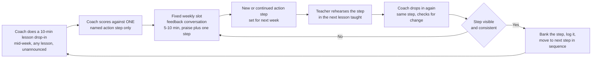
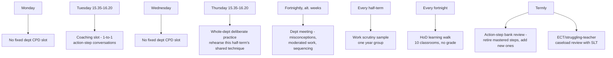
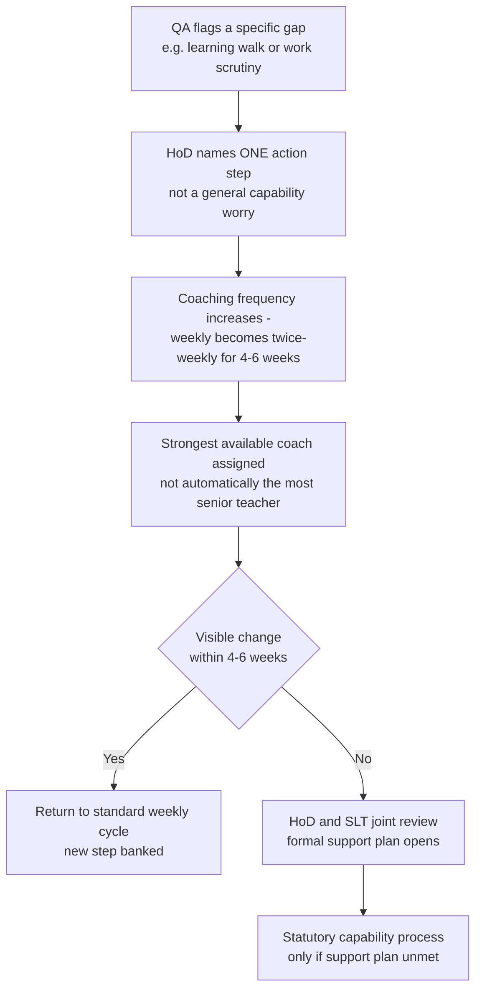

# Department 05 — Teaching Coaching and Quality Assurance

*Operational layer beneath blueprint Section 2 (Curriculum, Pedagogy and Assessment) and Section 3 (Coaching and staff development), and beneath Bet 1 — "universal instructional coaching replaces performance appraisal" (`blueprint/1-vision-principles.md`). This document does not re-argue the whole-school case; it specifies what a Head of Department, a class teacher, a TA and a pupil actually do, week to week, to make Bet 1 real. Primary evidence: `research/22-coaching-quality-department-leadership.md`. Worked example throughout: the science department, 6FE secondary (900 pupils, Years 7–11 — `blueprint/0-canon.md`), led by a Head of Science (TLR1), with a KS3 curriculum TLR3 project inside it (Adam) — see `department/00-department-operating-model.md` §1 for the full role split.*

## 1. Who coaches whom

The whole-school constant (Section 3) is **~1 trained coach per 6–8 teachers**, with coaching load timetabled into middle-leadership directed time at **~2–3 protected periods/week per coach**. In a 6FE science department this is an **8–9 FTE** teaching team (the size `department/00-department-operating-model.md` §1 derives from ~119 taught periods/week), or roughly **10–13 individual teachers** once part-timers and reduced-timetable post-holders are counted, spanning biology/chemistry/physics/combined, so:

- The **HoD (TLR1)** coaches 6–8 teachers directly by default — this is the standing coaching caseload the whole-school constant assumes.
- The **Second-in-Department/lead practitioner** (TLR2) coaches the remaining 4–6, usually the KS4/KS5 specialists — the overflow the HoD cannot reach (`department/00-department-operating-model.md` §1).
- **No coach carries more than 8.** If department size grows past ~16 individual teachers (e.g. a larger all-through or federated science team), a third coach (a Level 3 Steplab-trained subject lead, not necessarily the most senior person) is added — coaching capacity is a staffing decision the HoD makes explicitly at the start of each year, not an afterthought once the timetable is set.
- **Coaches are themselves coached.** Following Dixons' "universal, not just strugglers or ECTs" model (research/22), the HoD does not opt out by virtue of seniority — the HoD is coached by an SLT link or an external subject-specialist coach, exactly as their own coachees are coached by them. The KS3 curriculum TLR3 lead (Adam, see §5) is not a coach of record at all: his TLR3 is a bounded curriculum project, not a standing place in the coaching hierarchy.

## 2. The weekly coaching cycle

One granular **action step** per teacher per week, drawn from a shared departmental bank — never invented fresh in the moment (research/22; Steplab model). The cycle:

Mechanics that make this survive a real term (research/22 design implications 2–3):

- **The slot is named and fixed** — for science this is **Tuesday 15:35–16:20**, one of the two whole-staff deliberate-practice sessions inside the published directed-time budget (`blueprint/3-structure-operations.md`), not squeezed into "whenever there's time." A coaching conversation that gets bumped by a data deadline does not happen — so it is protected the same way the 15:30–16:30 pupil block is protected: capped exceptions, logged when missed, reported to SLT if missed twice running.
- **The action-step bank is departmental, not personal.** For science it holds ~15–20 entries under four headings that map onto the whole-school teaching model (`blueprint/2-curriculum-pedagogy.md` §3): retrieval and Do Now design (e.g. "interleave two units' worth of recall, not just last lesson's"); explicit instruction and modelling (e.g. "narrate the worked example before revealing the answer, not alongside it"); questioning and checking for understanding (e.g. "cold-call before naming who answers; use mini-whiteboards for a full-class check before moving on"); and practical-specific technique (e.g. "state the hazard and the reason, not just the rule, before handing out equipment" — the department's own addition, since generic coaching banks are not written for a lab).
- **One step at a time, sequenced, not a checklist.** A teacher who has banked "cold-call before reveal" moves to "extend wait time after cold-call," not to an unrelated step — this term's step visibly builds on last term's (research/22 design implication 2).
- **Ungraded.** No lesson observation grade, no Ofsted-style descriptor, ever attached to a drop-in. The only artefact is the action step and whether it's visible next time.

## 3. QA: learning walks and work scrutiny, developmental not graded

Ofsted's own 2025 framework has moved the same direction: learning walks and professional conversation replace high-stakes graded "deep dives," and inspectors are told to look for "what is typical," not a performance ([Schools inspection toolkit, updated 5 Nov 2025](https://assets.publishing.service.gov.uk/media/690b26c69456634d9795fde0/Schools_inspection_toolkit.pdf)). The department's internal QA is built to mirror that logic exactly, so there is no gap between "what we do every week" and "what Ofsted would see" (research/22).

- **Fortnightly HoD learning walks** — 10 departmental classrooms, ~5 minutes each, no notice, no grade. The HoD is checking for the *typical* lesson against the department's current shared action-step focus (e.g. this half-term: retrieval starters), not auditing an individual teacher's file.
- **Half-termly work scrutiny** — a sample of exercise books/folders across the ability range in one year group, rotating through Years 7–11 across the year, checking whole-class feedback is happening (not written marking — `blueprint/2-curriculum-pedagogy.md` §3) and that pupils are acting on it, not that every page is annotated.
- **Findings feed the action-step bank, not a grading spreadsheet.** If the walk shows cold-call is inconsistent department-wide, that becomes next fortnight's whole-staff deliberate-practice focus (§4) — QA output is an input to coaching, the same loop as the individual cycle in §2, run at department level.
- **TA and technician deployment is QA'd against the EEF's rule, explicitly** (research/22 design implication 7): science technicians are timetabled for practical prep and H&S, never folded into pupil-facing TA cover; TAs scaffold the lowest-attaining pupils toward independence across a group, never "velcroed" to one EHCP pupil; and any TA-led intervention (e.g. pre-teaching key vocabulary before a practical) is scripted and trained by the HoD, checked at the same half-termly scrutiny point — the EEF's *Deploying Teaching Assistants* guidance shows this is the difference between +3–4 months and a negative effect ([EEF guidance, March 2025](https://educationendowmentfoundation.org.uk/education-evidence/guidance-reports/teaching-assistants)).

## 4. Department CPD in directed time

The blueprint (`blueprint/3-structure-operations.md`) fixes **twice-weekly whole-staff deliberate practice**, ~15:35–16:20, inside the published directed-time budget — never a pre-08:00 add-on. One of those two sessions each week is the individual coaching slot (§2); the other is **whole-department rehearsal of the same shared technique**, Dixons-style (research/22): teachers practise the half-term's focus technique on each other or on a scripted scenario, in pairs, before using it live with pupils. This is deliberately narrow — one technique, drilled, not a rotating menu of generic INSET topics.

The **separate fortnightly department meeting is stripped of everything that isn't teaching quality** (research/22 design implication 4, Michaela principle): behaviour/detention admin, resourcing, and data entry are centralised school-level systems, not HoD time. What's left on the agenda:
1. Shared misconceptions surfaced by the coaching cycle and QA that fortnight (5–10 min).
2. Moderated work samples — comparative judgement on a shared writing/extended-answer task (`blueprint/2-curriculum-pedagogy.md` §7), not individual marking review.
3. Curriculum sequencing for the next 2–3 weeks against the bought-in spine (Oak National Academy / mastery provider — `blueprint/2-curriculum-pedagogy.md` §2), adapted for the department's own cohort.

## 5. The support pathway: struggling teacher or early-career teacher

From September 2025, ITT and the ECF were folded into one **ITTECF framework** spanning ITT through induction year 2, with mentor training cut from two years to one specifically to reduce mentor workload ([Ambition Institute explainer](https://www.ambition.org.uk/what-is-the-ittecf-and-what-does-it-mean-for-the-early-career-framework/)). But NFER's evaluation of the early ECF roll-out found a **null effect on retention overall**, with mentor workload the standout implementation failure, and year-2 retention nationally sits at **89.7%** ([NFER evaluation](https://www.nfer.ac.uk/publications/evaluation-of-the-early-roll-out-of-the-early-career-framework/); [DfE stats](https://explore-education-statistics.service.gov.uk/find-statistics/teacher-and-leader-development-ecf-and-npqs/2024-25)). The lesson for the department (research/22 design implication 6): **the national entitlement is content, not time.** What actually moves practice and retention is protected mentor time and mentor skill, which is a staffing and timetabling decision the HoD makes, not something the DfE framework supplies on its own.

**Worked example: Adam, ECT2 and KS3 curriculum TLR3.** A genuinely ECT-heavy department (the blueprint plans to be one — `blueprint/3-structure-operations.md` §Staffing) can put a talented early-career teacher into a bounded curriculum-lead project before their statutory induction ends, provided the two roles stay honestly separate — Adam is a class teacher holding a TLR3 *project*, not the department head. STPCD is explicit that TLR3 funds a clearly time-limited school-improvement project, not a continuing responsibility, so it cannot be the department headship or a standing coaching caseload (`department/00-department-operating-model.md` §1); the permanent HoD (TLR1) and Second-in-Department (TLR2) hold those roles regardless of who is the strongest early-career hire that year:

- Adam is **still coached weekly**, by the HoD or an external subject-specialist coach — not by a peer he manages, and not skipped because he holds a TLR. His action-step cycle runs exactly as in §2.
- Adam's **statutory mentor time is protected and separate from his TLR time** — a real reduction elsewhere in his timetable (fewer teaching periods that fortnight), never mentoring or being mentored "on top." This is the specific failure NFER flagged nationally; the department fixes it by making the swap visible on the timetable, not assumed.
- Adam's **TLR3 project (the KS3 scheme, knowledge organisers, resource bank) is scoped and time-boxed, not a standing coaching caseload** — he is not one of the department's 6–8-teacher coaches of record (§1) while he is carrying his own induction; the HoD and 2ic hold that coaching load between them.

**For any teacher — ECT or experienced — flagged through QA (§3) as struggling on a specific, named technique:**

The department never jumps straight to a graded observation or a capability letter (research/22 §"Michaela strips department time of everything but teaching quality" plus the Ofsted-aligned ungraded logic in §3 above) — the escalation ladder is intensified coaching first, named and time-boxed, with SLT drawn in only if that fails, and formal capability only if the support plan itself is unmet. This is deliberately the same shape as the pupil intervention model in `blueprint/2-curriculum-pedagogy.md` §5 (named, timetabled, dosage-logged, with an exit criterion) — the department applies the same intervention discipline to its own staff that it applies to pupils.

## 6. What we tell staff, honestly

Kraft et al.'s meta-analysis gives coaching **0.49 SD on instructional quality and 0.18 SD on pupil achievement** (shrinking to **~0.10 SD once at scale**), and dosage does not predict effect size — quality and focus of a short weekly conversation beat occasional long ones ([Kraft, Blazar & Hogan 2018](https://scholar.harvard.edu/files/mkraft/files/kraft_blazar_hogan_2018_teacher_coaching.pdf)). Sims et al.'s 2025 review-of-reviews found the average professional-development effect in *preregistered* trials is not significantly different from zero ([Sims et al. 2025, RER](https://journals.sagepub.com/doi/10.3102/00346543231217480)), and a 2025 critique warns that teaching is not a "performance profession" fully reducible to decomposable skills the way music or sport is ([Perry, *BJES* 2025](https://www.tandfonline.com/doi/full/10.1080/0305764X.2025.2516524)). The department's line to staff, matching research/22 design implication 8: coaching is **our best bet, well-implemented** — not a guaranteed number of months of pupil progress. Action steps stay few, concrete and sequenced; the HoD does not let the coaching system substitute for professional judgement on what a lesson actually needs.

## Sources

- Kraft, Blazar & Hogan (2018), coaching meta-analysis: https://scholar.harvard.edu/files/mkraft/files/kraft_blazar_hogan_2018_teacher_coaching.pdf
- Sims et al. (2025), PD review-of-reviews, RER: https://journals.sagepub.com/doi/10.3102/00346543231217480
- Perry (2025), critique of deliberate practice in teaching, BJES: https://www.tandfonline.com/doi/full/10.1080/0305764X.2025.2516524
- EEF Effective Professional Development guidance report: https://d2tic4wvo1iusb.cloudfront.net/production/eef-guidance-reports/effective-professional-development/EEF-Effective-Professional-Development-Guidance-Report.pdf
- EEF, Deploying Teaching Assistants guidance (updated March 2025): https://educationendowmentfoundation.org.uk/education-evidence/guidance-reports/teaching-assistants
- Dixons Academies Trust, coaching and practice: https://www.dixonsat.com/why/coaching-and-practice
- Steplab, evidence and rationale: https://steplab.co/resources/the-evidence-and-rationale-behind-steplab/66d9c87f0982810001156bd9
- Ambition Institute, ITTECF explainer: https://www.ambition.org.uk/what-is-the-ittecf-and-what-does-it-mean-for-the-early-career-framework/
- NFER, evaluation of early ECF roll-out: https://www.nfer.ac.uk/publications/evaluation-of-the-early-roll-out-of-the-early-career-framework/
- DfE, ECF/NPQ statistics 2024-25 (ECT year-2 retention): https://explore-education-statistics.service.gov.uk/find-statistics/teacher-and-leader-development-ecf-and-npqs/2024-25
- Ofsted, Schools inspection toolkit, updated 5 Nov 2025: https://assets.publishing.service.gov.uk/media/690b26c69456634d9795fde0/Schools_inspection_toolkit.pdf
- `blueprint/0-canon.md`, `blueprint/2-curriculum-pedagogy.md`, `blueprint/3-structure-operations.md`, `blueprint/1-vision-principles.md` (Bet 1)
- `research/22-coaching-quality-department-leadership.md`
